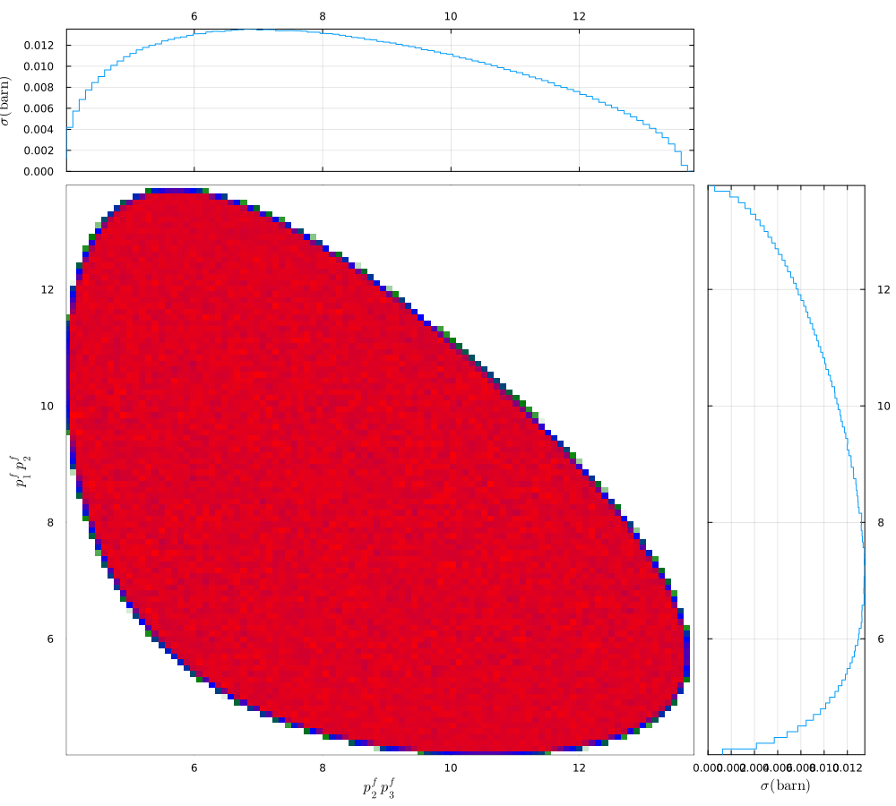

# DalitzPlot

This Julia package, designed for plotting Dalitz plots, allows users to visualize particle three-body decays with a specified amplitude. The package offers flexibility in amplitude settings, enabling users to customize the plot according to their specific requirements. 

## Installation

To install the package, use the standard Julia package manager procedure:

```julia
Pkg.add("DalitzPlot")
using DalitzPlot
```

## Examples

Provide the amplitudes. Here we take it as 1
```julia
amp(tecm, kf, ch, para)=1.
```
Provide the mass of initial and final particles.
```julia
ch = (mi=[1.0, 1.0], mf=[1.0, 1.0, 1.0],namei=["p^i_{1}", "p^i_{2}"], namef=["p^f_{1}", "p^f_{2}", "p^f_{3}"], amp=amp) 
```
Provide the momentum
```julia
p = 10.0
```
Calculate 
```julia
res = Xsection(plab2pcm(p, ch.mi), ch, nevtot=Int64(1e7), para=(p=p, l=1.0), ProgressBars=true)
```
Plot Dalitz Plot.
```julia
plotD(res, ch, axes=[1, 3])
```




