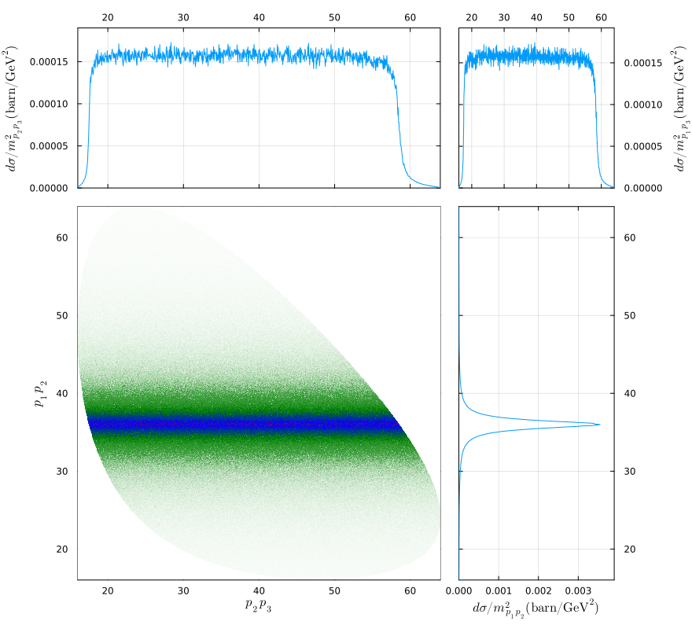

# Outline
- [DalitzPlot.jl](#dalitzplotjl)
  - [Installation](#installation)
  - [Usage](#usage)
- [Xs Package: for decay width, cross section, invariant mass spectrum, and Dalitz plot](#xs-package-for-decay-width-cross-section-invariant-mass-spectrum-and-dalitz-plot)
  - [Define amplitudes with factors for the calculation](#define-amplitudes-with-factors-for-the-calculation)
  - [Define the masses of initial and final particles](#define-the-masses-of-initial-and-final-particles)
  - [Define the momentum or total energy](#define-the-momentum-or-total-energy)
  - [Calculate](#calculate)
  - [Dalitz plot generation and identical particle treatment](#dalitz-plot-generation-and-identical-particle-treatment)
  - [Plot Dalitz Plot](#plot-dalitz-plot)
  - [other functions](#other-functions)
    - [Bin](#bin)
    - [Frame Transformation](#frame-transformation)
- [GEN Package: for Generating Events](#gen-package-for-generating-events)
- [FR Package: for Numerical Calculation of Feynman Rules](#fr-package-for-numerical-calculation-of-feynman-rules)
- [Basic conventions.](#basic-conventions)
  - [Dirac Gamma matrices.](#dirac-gamma-matrices)
  - [Functions for particles with different spins](#functions-for-particles-with-different-spins)
    - [Spinor for $S=1/2$](#spinor-for-s12)
    - [Polarized vector for $S=1$](#polarized-vector-for-s1)
    - [Rarita-Schwinger Spinor for $S=3/2$](#rarita-schwinger-spinor-for-s32)
    - [Levi-Civita tensor](#levi-civita-tensor)
  - [Additional defintions to operations](#additional-defintions-to-operations)
  - [Get the azimuthal angle trigonometric functions of a momentum](#get-the-azimuthal-angle-trigonometric-functions-of-a-momentum)
- [PLOT Package: for plotting](#plot-package-for-plotting)
  - [Plotting the invariant mass spectrum and Daltiz plot](#plotting-the-invariant-mass-spectrum-and-daltiz-plot)
  - [Read the data from a file](#read-the-data-from-a-file)
- [AUXs Package: for Auxiliary functions](#auxs-package-for-auxiliary-functions)
  - [Fitting](#fitting)
  - [Variable Broadcasting](#variable-broadcasting)
  - [Significance Calculation](#significance-calculation)

<!-- tocstop -->

# DalitzPlot.jl

This Julia package is designed for high-energy physics applications. It
was originally developed for visualizing and analyzing particle decays
using Dalitz plots, but its functionality has since expanded beyond
Dalitz plots to support a wide range of features. It consists of the
following subpackages (after v0.1.8, the package was divided into
several subpackages):

-   `Xs`: A module that provides utilities for cross section
    calculations and the generation of Dalitz or Dalitz-like plots,
    which are crucial for visualizing three-body and multi-body decays
    (up to 10 particles). Users can specify amplitudes to generate these
    plots.
-   `GEN`: Stands for Event Generation. This subpackage is responsible
    for generating events, which users can then utilize for tasks such
    as cross section calculations or decay analysis. It is used
    internally by `Xs`.
-   `FR`: Focuses on Feynman rules. This subpackage includes functions
    for calculating spinor or polarized vectors with momentum and spin,
    gamma matrices, and other related calculations.
-   `qBSE`: Refers to the Quasipotential Bethe-Salpeter Equation. This
    subpackage provides tools for solving the Bethe-Salpeter equation,
    which is used in the study of bound states in quantum field theory.
    This is a specific theoretical model, and those not interested can
    disregard it. For those interested, please refer to `doc/qBSE.md`.
-   `AUXs`: A collection of auxiliary functions designed to support and
    enhance the functionality of the main subpackages.

> **Note**: This package is primarily intended for theoretical and
> phenomenological studies. For experimental data analysis, please
> consider using specialized tools designed for that purpose.

## Installation

To install the "DalitzPlot" package, you can follow the standard Julia
package manager procedure. Open Julia and use the following commands:

Using the Julia REPL

``` julia
Pkg.add("DalitzPlot")
```

Alternatively, to install the latest development version directly from
the GitHub repository, use:

At the Julia REPL:

``` julia
import Pkg
Pkg.add(url="https://github.com/junhe1979/DalitzPlot.jl")
```

These commands will install the "DalitzPlot" package and allow you to
use it in your Julia environment.

## Usage

After installation, the package can be used as:

``` julia
using DalitzPlot
```

To use the subpackages:

``` julia
using DalitzPlot.Xs
using DalitzPlot.GEN
using DalitzPlot.FR
using DalitzPlot.qBSE
using DalitzPlot.PLOT
using DalitzPlot.AUXs
```

# Xs Package: for decay width, cross section, invariant mass spectrum, and Dalitz plot

The cross section, denoted by $d\sigma$, can be expressed in terms of
amplitudes, ${\mathcal M}$, as follows:

$d\sigma=F\frac{1}{S}|{\mathcal M}|^2d\Phi=(2\pi)^{4-3n}F\frac{1}{S}|{\mathcal M}|^2dR$

The decay width in CMS is given as

$d\Gamma = \frac{1}{2M} |{\mathcal M}|^2 d\Phi=\frac{ (2\pi)^{4-3n}}{2M}  |{\mathcal M}|^2 dR$.

Here,
$dR = (2\pi)^{3n-4} d\Phi = \prod_{i}\frac{d^3k_i}{2E_i}\delta^4(\sum_{i}k_i-P)$
represents the Lorentz-invariant phase space for $n$ particles, and it
is generated using the Monte-Carlo method described in Ref. \[F. James,
CERN 68-15\].

The flux factor $F$ for the cross section is given by:
$F=\frac{1}{2E2E'v_{12}}=\frac{1}{4[(p_1\cdot p_2)^2-m_1^2m_2^2]^{1/2}}    \frac{|p_1\cdot p_2|}{p_1^0p_2^0}$.
In the laboratory or center of mass frame, the relation
$\vec{p}_1^2 \vec{p}_2^2 = (\vec{p}_1 \cdot \vec{p}_2)^2$ is utilized.
In the laboratory frame, the term $\frac{|p_1\cdot p_2|}{p_1^0 p_2^0}$
simplifies to 1. Additionally, if a boson or zero-mass spinor particle
is replaced with a non-zero mass spinor particle, the factor $1/2$ is
replaced with the mass of the particle, $m$. The total symmetry factor
$S$ is given by $\prod_i m_i!$ if there are $m_i$ identical particles.

## Define amplitudes with factors for the calculation

Users should provide the amplitude function, named `amp`, which returns
the full expression $(2\pi)^{4-3n}F\frac{1}{S}|{\mathcal M}|^2$ needed
for the cross section calculation. Alternatively, you may define `amp`
to return only $|{\mathcal M}|^2$, and then multiply by the factor
$(2\pi)^{4-3n}F\frac{1}{S}$ separately during the calculation.

The simplest case is to assume it equals 1.

``` julia
amp(tecm, kf, proc, para, p0)=1.
```

Define more intricate amplitudes for a 2-\>3 process.

This function, named `amp`, calculates amplitudes with factors for a
2-\>3 process. The input parameters are:

-   `tecm`: Total energy in the center-of-mass frame.
-   `kf`: Final momenta generated internally by `GEN`.
-   `proc`: Information about the process (to be defined below).
-   `para`: Additional parameters.
-   `p0`: Additional parameters for possible fitting.

Users are expected to customize the amplitudes within this function
according to their specific requirements.

``` julia

function amps(tecm, kf, proc, para, p0)

    # get kf as momenta in the center-of-mass ,
    #k1,k2,k3=kf   
    #get kf as momenta in laboratory frame
    k1, k2, k3 = Xs.getkf(para.p, kf, proc)

    # Incoming particle momentum
    # Center-of-mass frame: p1 = [p 0.0 0.0 E1]
    #p1, p2 = pcm(tecm, proc.mi)
    # Laboratory frame
    p1, p2 = Xs.plab(para.p, proc.mi)

    #flux
    #flux factor for cross section
    fac = 1e9 / (4 * para.p * proc.mi[2] * (2 * pi)^5)

    k12 = k1 + k2
    s12 = k12 * k12
    m = 6.0
    A = 1 / (s12 - m^2 + im * m * 0.1)

    total = abs2(A) * fac * 0.389379e-3

    return total
end
```

## Define the masses of initial and final particles

The masses of initial and final particles of a physcial process are
specified in a NamedTuple (named `proc` here) with fields `mi` and `mf`.
Particle names can also be provided for PlotD as `namei` and `namef`.

The function for amplitudes with factors is saved as `amp`.

Example usage:

``` julia
proc = (pf=["p1","p2","p3"],mi=[1.,1.], mf=[1., 2., 3.], namei=["p^i_{1}", "p^i_{2}"], namef=["p^f_{1}", "p^f_{2}", "p^f_{3}"], amps=amps)
```

Here, the masses of the initial particles `[mass_i_1, mass_i_2]` and
final particles `[mass_f_1, mass_f_2, mass_f_3]` are set to
`1.0, 1.0, 1.0, 2.0, 3.0`, respectively.

## Define the momentum or total energy

Momentum in the Laboratory frame and transfer it to the total energy in
the center-of-mass frame.

Example usage:

``` julia
p_lab = 20.0
tecm = Xs.pcm(p_lab, proc.mi)
tecm=10.
```

Here the momentum of the incoming particle in the Laboratory frame is
set to `20.0` GeV, and the center-of-mass energy is calculated using the
`Xs.pcm` function. The value of `tecm` can be set directly to `10.0` GeV
if desired.

## Calculate

The function `Xsection` takes the momentum in CMS (`tecm`), the
information about the physcial process (`proc`), the axes representing
invariant masses (`axes`), the total number of events (`nevtot`), the
number of bins (`Nbin`), and additional parameters (`para`). The
function uses the plab2pcm function to transform the momentum from the
Laboratory frame to the center-of-mass frame.

Example usage:

``` julia
using ProgressBars
function progress_callback(pb)
   ProgressBars.update(pb)  
end
nevtot=Int64(1e7)
pb = ProgressBar(1:nevtot)  
callback = i -> progress_callback(pb)  
res = Xs.Xsection(tecm, proc, callback,axes=["p2:p3", "p1:p2"], nevtot=Int64(1e7), Nbin=500, para=(p=p_lab, l=1.0),stype=2)
```

The calculation results are stored in the variable `res` as a
`NamedTuple` with the following fields:

-   `res.cs0::Vector{Float64}`: Length matches the output of function
    `amps`. The total cross section or decay width, calculated as
    $\int \text{amp}dR$. The result is given in units of
    $\text{GeV}^{-2}$. To convert to barns, use the relation
    $1~\text{GeV}^{-2} = 0.3894~\text{mb}$.
-   `res.cs1::Vector{Matrix{Float64}}`: Vector length equals the output
    of function `amps`. The two-dimensional `Matrix` uses its first
    index for axes and second index for bins. The invariant mass
    spectrum, given by $d\int \text{amp}  dR/dx$, where $x$ is the
    invariant mass $m_{ij}$ of the first two particles (`stype=1`) or
    the squared invariant mass $s_{ij} = m_{ij}^2$ (`stype=2`). The
    spectrum is binned according to the specified range and number of
    bins (`Nbin`).
-   `res.cs2::Vector{Matrix{Float64}}`: Vector length equals the output
    of function `amps`. Both indices of the two-dimensional `Matrix`
    correspond to bins. The two indices of two dimensional `Matrix` are
    both for bins. The Dalitz plot as $d\int \text{amp} dR/dxdy$.

These results allow you to analyze the total cross section, invariant
mass distributions, and Dalitz plot for your process.

If you want to use the `Xs.Xsection` function in parallel, you can use
the `Distributed` package and remove `callback`. Here is an example of
how to do this:

``` julia
using Distributed
addprocs(1; exeflags="--project")
@everywhere using DalitzPlot.qBSE, DalitzPlot.FR, DalitzPlot.Xs, DalitzPlot.GEN, DalitzPlot.PLOT, DalitzPlot.AUXs
Ecm = 20.0
nevtot = Int64(1e7)
@everywhere amps(tecm, kf, proc, para, p0) = 1.
proc = (pf=["p1", "p2", "p3"],
    mi=[1.0, 1.0], mf=[2.0 for i in 1:3],
    namei=["p^i_{1}", "p^i_{2}"], namef=["p^f_{1}", "p^f_{2}", "p^f_{3}"],
    amps=amps)
res = Xs.Xsection(10.0, proc, axes=["p2:p3", "p1:p2"], nevtot=nevtot, Nbin=1000,
    para=(p=8000.0, l=1.0), stype=2)
```

## Dalitz plot generation and identical particle treatment

The function `Xs.Xsection` computes differential cross sections and Dalitz plot  for multi‑body final states.  
A central feature is the correct handling of **identical particles**, both at the level of amplitude symmetrisation (which must be provided by the user) and at the level of histogram filling.

### The `symmetrize` keyword

The function `cross_section` (or `Xs.xsection`) accepts a keyword argument `symmetrize::Bool` (default `true`) that controls how the Dalitz plot and the one‑dimensional invariant mass spectra are filled.

- **`symmetrize = true`** (default)  
  - Produces a **symmetrised Dalitz plot**.  
  - For every event, **all physically allowed pairings** of the particles specified by the axes are identified and filled into the histograms.  
  - The allowed pairings are determined with the following priority:  
    - completely non‑overlapping particle sets,  
    - sets sharing exactly one particle,  
    - sets that are not subsets of each other (if none of the above are found),  
    - all possible pairs (only as a last resort, with a warning).  
  - The event weight is divided by the number of pairings, so that the total contribution of one event remains equal to its original Monte‑Carlo weight.  
  - This approach mimics the standard experimental procedure for final states with identical particles (e.g. three $\pi^0$ or two $\pi^+$): the resulting distributions are independent of arbitrary particle labels and have improved statistical precision.

- **`symmetrize = false`**  
  - Produces a **fixed‑label Dalitz plot**.  
  - Only a single, predefined pairing is used per event. This pairing is chosen by the algorithm as the first valid one found, with the following priority:  
    -  completely non‑overlapping particle sets,  
    -  sets sharing exactly one particle.  
  - If neither can be found, the first combination of each axis is taken (a warning is issued).  
  The resulting distribution corresponds to a differential cross section with a specific (though arbitrary) labelling convention.  
  
*Provided the amplitude is properly (anti‑)symmetrised with respect to identical particles, the shape of the fixed‑label Dalitz plot is identical to that of the symmetrised one; only the statistical precision differs.*

**Important:** The `symmetrize` flag only affects histogram filling. The quantum‑mechanical amplitude supplied by the user **must already satisfy Bose or Fermi symmetry** for identical particles. The code does not symmetrise the amplitude itself.

### How identical particles are handled internally

The procedure consists of three steps:

#### 1. Generation of unique index combinations for each axie
For each axis string (e.g. `"p1:p1"` or `"p1:p2"`), the code first finds all occurrences of the specified particles in the final-state particle list and then generates all possible assignments of these particles to the final-state momenta. For example, if the final-state particles are ordered as `p1`, `p1`, `p2`, corresponding to particle indices $1$, $2$, and $3$, respectively, the axis `"p1:p1"` initially generates the assignments $[1,2]$ and $[2,1]$, whereas `"p1:p2"` generates $[1,3]$ and $[2,3]$.

When all particles appearing in an axis have the same name, the generated index combinations are sorted and deduplicated. Thus, for `"p1:p1"`, the assignments $[1,2]$ and $[2,1]$ are identified as the same physical combination and only the sorted combination $[1,2]$ is retained. In contrast, for an axis containing different particle names, such as `"p1:p2"`, no such sorting or deduplication is applied, and the two combinations $[1,3]$ and $[2,3]$ are retained as distinct combinations.

After this step, each axis is therefore associated with the list of particle-index combinations used subsequently to construct the invariant-mass distributions.

#### 2. Building valid Dalitz pairs (`fill_pairs`)

For a two-dimensional distribution, the first two axes are used to construct the Dalitz variables. Suppose the combinations associated with the first and second axes are denoted by $c_1$ and $c_2$, respectively. The code constructs the list `fill_pairs` in the following sequence.

1. **First, search for non-overlapping pairs.**

   The code loops over all combinations $c_1$ from the first axis and $c_2$ from the second axis and checks whether they have no particle indices in common, i.e. $\mathrm{intersect}(c_1,c_2)=\varnothing$.

   Every pair satisfying this condition is added to `fill_pairs`, provided that an equivalent pair has not already been included. For example, for a four-particle final state, this can generate pairs such as $([1,2],[3,4])$.

2. **If no non-overlapping pair is found, search for pairs sharing exactly one particle.**

   This step is performed only when `fill_pairs` is still empty after the first search. The code again loops over all $c_1$ and $c_2$ and selects pairs satisfying $|\mathrm{intersect}(c_1,c_2)|=1$.

   Here, $|\mathrm{intersect}(c_1,c_2)|=1$ means that the two invariant-mass combinations contain **exactly one common final-state particle index**. For example,

   $[1,2]$ and $[1,3]$ share particle $1$,

   $[1,2]$ and $[2,3]$ share particle $2$,

   and $[1,3]$ and $[2,3]$ share particle $3$.

   Therefore, the three possible pairs

   $([1,2],[1,3])$, $([1,2],[2,3])$, and $([1,3],[2,3])$

   all satisfy $|\mathrm{intersect}(c_1,c_2)|=1$. These are the standard pairs of two-particle invariant masses in a three-body system: each pair of invariant masses corresponds to two particle pairs that have one particle in common.


3. **If neither of the above searches produces a pair, use all combinations.**

   If `fill_pairs` remains empty after the second search, the code issues a warning and loops over all possible pairs $(c_1,c_2)$ without imposing any condition on their overlap. Every non-duplicate pair is then added to `fill_pairs`.

In all three steps, the code uses a duplicate check to avoid adding the same pair twice. Specifically, the function `is_dup(p)`checks whether the two invariant-mass combinations in the new pair have already appeared in `fill_pairs`, irrespective of their order. For example, the pairs

$( [1,2], [3,4] )$ and $( [3,4], [1,2] )$

contain the same two invariant-mass combinations, with only the first and second axes exchanged. The duplicate check therefore regards them as the same pair and keeps only one of them.

This duplicate check is different from the deduplication performed in the previous step. In Step 1, combinations such as $[1,2]$ and $[2,1]$ are identified because they correspond to the same invariant-mass combination of two identical particles. Here, the duplicate check is applied **between two invariant-mass combinations**: $( [1,2], [3,4] )$ and $( [3,4], [1,2] )$ are identified because they represent the same pair of variables with the two axes exchanged.

The resulting `fill_pairs` list is subsequently used to determine which pairs of invariant-mass combinations are filled in the two-dimensional distribution.

#### 3. Filling the histograms

* **2-D histogram (`zsumd`)**

  Only the first two axes are used to construct the two-dimensional distribution.

  In `symmetrize = true` mode, all valid pairs in `fill_pairs` are filled, and the event weight is divided equally among these pairs.

  In `symmetrize = false` mode, only the first valid pair in `fill_pairs` is used, and the full event weight is deposited.

* **1-D histograms (`zsumt`)**

  Every axis defined by the user produces its own one-dimensional invariant-mass spectrum.

  In `symmetrize = true` mode, all particle-index combinations associated with an axis are filled, with the event weight divided equally among these combinations.

  In `symmetrize = false` mode, only the first combination associated with each axis is used, with the full event weight.

  The 1-D spectra and the 2-D distribution are filled directly during the same event loop. Thus, no separate projection of the 2-D histogram is required to obtain the 1-D spectra.

#### 4. Event weight and normalisation

For each generated event, the code obtains the phase-space weight `wt` from `GENEV` and multiplies it by the corresponding amplitude returned by `proc.amps`. The resulting weighted amplitude is accumulated in `zsum`, `zsumt`, and `zsumd`.

The final result `cs0` is obtained by dividing the accumulated sum by the total number of generated events, `nevtot`. For the one- and two-dimensional distributions, the corresponding sums are additionally divided by the appropriate bin widths.

**Note on identical particles:**

The phase-space generator `GENEV` does **not** automatically include the statistical factor $1/N!$ for $N$ identical particles. Therefore, if the amplitude used in `proc.amps` is defined without this normalization factor, the corresponding factor must be included when calculating the absolute cross section. This can be done either by including the factor $1/\sqrt{N!}$ in the amplitude before squaring, or equivalently by dividing the final cross section by $N!$.

This statistical factor is independent of the weight sharing used for `symmetrize = true`. The latter only distributes the weight of one physical event among the different particle-index combinations used to fill an invariant-mass histogram; it does not provide the $1/N!$ identical-particle factor.


### Behaviour for more than two axes

The user may supply more than two axis strings. For example,

`axes = ["p1:p2", "p3:p4", "p1:p3"]`.

The first two axes are used to construct the two-dimensional distribution, while every axis produces its own one-dimensional invariant-mass spectrum.

The same combination and symmetrisation procedure is applied independently to each one-dimensional axis. For the two-dimensional distribution, however, only the first two axes enter `fill_pairs` and hence determine the pairs used to fill `zsumd`.


### Summary of the two symmetrisation options

The two options differ only in how many particle-index combinations are used when filling the invariant-mass distributions.

| Situation                        | `symmetrize = true`                                                                                                                                                                                                     | `symmetrize = false`                                                                    |
| -------------------------------- | ----------------------------------------------------------------------------------------------------------------------------------------------------------------------------------------------------------------------- | --------------------------------------------------------------------------------------- |
| **One-dimensional distribution** | Uses **all** allowed particle-index combinations. If an event has two combinations for an axis, both are filled, with the event weight divided equally between them.                                                    | Uses **only one** representative combination for each axis, with the full event weight. |
| **Two-dimensional distribution** | Uses **all valid pairs** in `fill_pairs`. The event weight is divided equally among these pairs.                                                                                                                        | Uses **only the first valid pair** in `fill_pairs`, with the full event weight.         |
| **Example: $3\pi^0$**            | The three combinations $[1,2]$, $[1,3]$, and $[2,3]$ are available. The corresponding valid pairs are $([1,2],[1,3])$, $([1,2],[2,3])$, and $([1,3],[2,3])$. Thus, one event can contribute to all three Dalitz points. | Only the first valid pair is used, so one event contributes to one Dalitz point.        |
| **Example: $4\pi^0$**            | The valid non-overlapping pairs are $([1,2],[3,4])$, $([1,3],[2,4])$, and $([1,4],[2,3])$. Thus, one event can contribute to all three Dalitz points.                                                                   | Only the first valid pair is used, so one event contributes to one Dalitz point.        |
| **Mixed final states**, e.g. $2\pi^+ + \pi^- + \pi^0$ | Uses all allowed particle-index combinations for each axis. For an axis involving the two identical $\pi^+$ mesons, both possible assignments are retained. For example, `pi+:pi-` gives $[1,3]$ and $[2,3]$, while `pi-:pi0` has only one combination, $[3,4]$. | Uses only one representative combination for each axis. |


Therefore, `symmetrize=true` means that **all allowed particle assignments are retained**, while `symmetrize=false` means that **only one representative assignment is retained**. The latter is useful when one wants to plot a fixed-label representation of the event sample.


## Plot Dalitz Plot

``` julia
DalitzPlot.PLOT.plotD(res)
```

This will generate the following Dalitz plot:



## other functions

### Bin

`binx(i::Int64, bin, iaxis::Int64)::Float64`

The function returns the value of the bin corresponding to the index `i`
for the specified axis.

**Arguments:** - `i::Int64` --- Bin index. - `bin` --- Vector containing
the bin edge definitions. - `iaxis::Int64` --- Index of the binning
axis.

**Returns:** - `Float64` --- The bin value corresponding to index `i`
for the specified axis.

`binrange(axis::String, tecm, proc, stype)`

Computes the value range for each specified binning axis based on the
given phase space dimensions. The function determines the extent of each
axis using the total center-of-mass energy and particle information.

**Arguments:** 

- `axis::String` --- A string with `:` specifying the binning axes. 

- `tecm::Float` --- Total energy in the
center-of-mass frame. 

- `proc::Process` --- Contains particle
definitions and kinematic properties. 

- `stype::Int` --- Specifies the
return type: `1` for mass, `2` for mass squared.

**Returns:** - `Vector{UnitRange}` --- A vector of ranges corresponding
to each input axis.

**Note:** The exact interpretation of each axis depends on its symbol
and the provided process information. The function is typically used in
phase space integration and event generation workflows.

`function binrange(laxes::Vector{Vector{Int64}}, tecm, proc, stype)`

based on the axes of the binning, the function `binrange` calculates the
range of values for each axis. Argument `laxes` is a vector of vectors
representing the axes of the binning.

`function binrange(laxes::Vector{Vector{Vector{Int64}}}, tecm, proc, stype; Range=[])`

This function is similar to the previous one but for a vector of
momenta. Range is a vector of vectors representing the given ranges for
each axis.

`function Nsij(kijs, min, max, Nbin)`

The function `Nsij` takes three arguments: `kijs`, which is a momentum,
`min`, which is the minimum value for the binning, and `max`, which is
the maximum value for the binning. The function returns the number of
bins for each axis based on the specified ranges.

`function Nsum3(laxes::Vector{Vector{Int64}}, i, bin::NamedTuple, kf, stype)`

The function `Nsum3` takes four arguments: `laxes`, which is a vector of
vectors representing the axes of the binning, `i`, which is an integer
index, `bin`, which is a NamedTuple containing information about the
bins, and `kf`, which is a momentum. The function returns the sum of the
values for each axis based on the specified ranges.

`function Nsum3(laxes::Vector{Vector{Vector{Int64}}}, bin::NamedTuple, kf, stype)`

This function is similar to the previous one but for a vector of
momenta. The function returns the sum of the values for each axis based
on the specified ranges.

### Frame Transformation

The package provides utilities for transforming kinematic variables
between different reference frames, such as the laboratory frame and the
center-of-mass (CMS) frame. This is essential for analyzing particle
collisions and decays, as calculations and measurements are often
performed in different frames.

Key functions include:

`function plab2pcm(p::Float64, mi::Vector{Float64})`:

Converts the momentum of the incoming particle in the laboratory frame
(`p`) and the masses of the initial particles (`mi`) to the total energy
in the CMS frame.

`function getkf(p, kf, proc)`

Retrieves the final state momenta in the desired frame, based on the
process information `proc` and input parameters.

`function plab(p, mi)`

Computes the momenta of the incoming particles in the laboratory frame
given the momentum `p` and the masses `mi`.

`function pcm(tecm::Float64, mi::Vector{Float64})`

Calculates the momentum of the incoming particles in the center-of-mass
frame given the total energy `tecm` and the masses `mi`.

These functions help ensure consistency when switching between frames
for event generation, amplitude calculation, and plotting.

# GEN Package: for Generating Events

The GEN package is used for generating events for cross-section
calculations and Dalitz plots. The Lorentz-invariant phase space used
here is defined as:

$dR = (2\pi)^{3n-4} d\Phi = \prod_{i}\frac{d^3k_i}{2E_i}\delta^4(\sum_{i}k_i-P)$

for $n$ particles. Such definition is different from that in PDG by a
factor of $(2\pi)^4$. The events are generated using the Monte-Carlo
method described in Ref. \[F. James, CERN 68-15\].

The primary function provided by this package is `GENEV`, which can be
used as follows:

``` julia
PCM, WT=GEN.GENEV(tecm,EM)
```

-   Input: total momentum in center of mass frame `tecm`, and the mass
    of particles `EM`.
    -   `tecm`: a `Float64` value representing the total momentum in the
        center of mass frame.
    -   `EM`: a `Vector{Float64}` containing the masses of the
        particles.
-   Output: the momenta of the particles `PCM`, and a weight `WT`.
    -   `PCM`: a StaticArrays `Vector{SVector{5,Float64}}` storing the
        momenta of the particles. Note that at most 18 particles can be
        considered.
    -   `WT`: `Float64` value representing the weight for this event.

# FR Package: for Numerical Calculation of Feynman Rules

# Basic conventions.

Since arrays in Julia are 1-indexed, a covariant 4-vector is represented
as an `SVector{5, Type}(v1, v2, v3, v0, v5)`. The first three elements
correspond to a 3-vector, the fourth element represents the time
component (or the 0th component), and the fifth element represents mass
in the case of momentum, but it is typically meaningless in most other
contexts. The addition of the fifth element serves to distinguish it
from the four-dimensional Dirac gamma matrices.

For example, a momentum is `SVector{5, Type}(kx,ky,kz,k0,m)`.

Note that the fifth element represents the mass of the particle. After
performing a `+/-` operation on two momentum vectors, the fifth element
of the resulting vector no longer has physical meaning. If the summed
momentum `p` is intended to represent a physical particle, its mass
should be explicitly set using `setindex(p, m, 5)`, where `m` is the
correct mass value.

Minkowski metric is chosen as $g^{\mu\nu}=diag(1,-1,-1,-1)$. In the
code, we still adopt above convention as

`g= SMatrix{5,5,Float64}([-1.0 0.0 0.0 0.0 0.0;0.0 -1.0 0.0 0.0 0.0;0.0 0.0 -1.0 0.0 0.0;0.0 0.0 0.0 1.0 0.0;0.0 0.0 0.0 0.0 0.0])`.

For example, $g^{00}$ is accessed as `FR.g[4,4]`.

***Note*** To avoid confusion, all covariant 4-vectors are written with
upper indices. Therefore, if multiplying 4-vectors directly in component
form, one must include the metric tensor `FR.g` (or a similar operation)
to ensure proper contraction.

## Dirac Gamma matrices.

We adopt the Dirac representation for the gamma matrices:

$$
\gamma^1=\left(\begin{array}{cccc}0&0& 0&1\\0&0&1&0\\0&-1&0&0\\-1&0&0&0\end{array}\right),
\gamma^2=\left(\begin{array}{cccc}0&0& 0&-i\\0&0&i&0\\0&i&0&0\\-i&0&0&0\end{array}\right),
\gamma^3=\left(\begin{array}{cccc}0&0& 1&0\\0&0&0&-1\\-1&0&0&0\\0&1&0&0\end{array}\right),
$$

$$
\gamma^0=\left(\begin{array}{cccc}1&0& 0&0\\0&1&0&0\\0&0&-1&0\\0&0&0&-1\end{array}\right),
\gamma^5=\left(\begin{array}{cccc}0&0& 1&0\\0&0&0&1\\1&0&0&0\\0&1&0&0\end{array}\right),
I=\left(\begin{array}{cccc}1&0& 0&0\\0&1&0&0\\0&0&1&0\\0&0&0&1\end{array}\right),
$$

The Dirac gamma matrices are represented by the array
GA=$[\gamma^1,\gamma^2,\gamma^3,\gamma^0,\gamma^5]$, with each gamma
matrix defined as `SMatrix{4,4,ComplexF64}`.

For example, $\gamma^2$ can be accessed as `FR.GA[2]` and has the type
`SMatrix{4,4,ComplexF64}`. The unit matrix is accessed as `FR.I`

A function `FR.GS` is provided for calculate $\gamma \cdot k$ as
`function GS(k::SVector{5, Type})::SMatrix{4,4,ComplexF64}`

## Functions for particles with different spins

`l::Int64` in the followings is for the **helicity** of the particle.
`bar=true` means that output is $\bar{u}$ or $\bar{u}^\mu$. `V=true`
means that output is for antifermion $v$. `star=true` is for the
polarized vector with a complex conjugation.

### Spinor for $S=1/2$

`function U(k, l::Int64; bar=false, V=false)::SVector{4,ComplexF64}`

with normalization $\bar{u}_\lambda(k)u_{\lambda'}(k)=\delta_{\lambda\lambda'}$

### Polarized vector for $S=1$

`function eps(k, l::Int64; star=false)::SVector{5,ComplexF64}`

with normalization $\varepsilon^{\mu*}_\lambda(k)\varepsilon_{\lambda'\mu}(k)=-\delta_{\lambda\lambda'}$

### Rarita-Schwinger Spinor for $S=3/2$

`function U3(k, l::Int64; bar=false, V=false)::SVector{5,SVector{4, ComplexF64}}`

with normalization $\bar{u}^\mu_\lambda(k)u_{\lambda'\mu}(k)=-\delta_{\lambda\lambda'}$

### Levi-Civita tensor

`function LC(a::SVector, b::SVector, c::SVector)`:
$\epsilon^{\mu\nu\rho\lambda}a_\mu b_\nu c_\rho$.

`function LC(i0::Int64, i1::Int64, i2::Int64, i3::Int64)`:
$\epsilon^{\mu\nu\rho\lambda}$

`function LC(a::SVector, b::SVector, c::SVector, d::SVector)`:
$\epsilon^{\mu\nu\rho\lambda}a_\mu b_\nu c_\rho d_\lambda$.

***Note*** Here, the Levi-Civita tensor is defined with upper indices
$\epsilon^{\mu\nu\rho\lambda}$ with convention
$=\epsilon^{0123}=-\epsilon_{0123}=1$, and all resultant quantities will
likewise carry upper indices. The input vectors a, b, c, and d are also
specified in their contravariant form
(${\rm a}^{\mu}$,${\rm b}^{\mu}$,${\rm c}^{\mu}$,${\rm d}^{\mu}$).

## Additional defintions to operations

More methods are added for multiplying of polarized vector, spinor, and
gamma matrices.

$Q\cdot W$, the dot product of two four-vectors $Q$ and $W$ (for
momentum, polarized vector):

`function *(Q::SVector{5,Float64}, W::SVector{5,Float64})::Float64`,

`function *(Q::SVector{5,Float64}, W::SVector{5,ComplexF64})::ComplexF64`,

`function *(Q::SVector{5,ComplexF64}, W::SVector{5,Float64})::ComplexF64`,

`function *(Q::SVector{5,ComplexF64}, W::SVector{5,ComplexF64})::ComplexF64`.

$AM$, A row vector $A$ multiplied by a matrix $M$ (for spinor and gamma
matrices)：

`function *(A::SVector{4, ComplexF64}, M::SMatrix{4, 4, ComplexF64, 16})`

$AB$, A row vector $A$ multiplied by a column vector $B$ (for spinor and
gamma matrices)：

`function *(A::SVector{4, ComplexF64}, B::SVector{4, ComplexF64})`

$A\pm B$, the sum of a scalar and a matrix:

`function -(A::T, B::SMatrix{4,4,ComplexF64,16}) where {T <: Number}`

`function -(B::SMatrix{4,4,ComplexF64,16},A::T) where {T <: Number}`

`function +(A::T, B::SMatrix{4,4,ComplexF64,16}) where {T <: Number}`

`function +(B::SMatrix{4,4,ComplexF64,16},A::T) where {T <: Number}`

## Get the azimuthal angle trigonometric functions of a momentum

The function

``` julia
ct, st, cp, sp, expp, zk0, zm, zkk = kph(k::SVector{5,ComplexF64})
```

returns several useful quantities for a given momentum vector `k` (with
type `SVector{5,ComplexF64}`):

-   `ct`: $\cos\theta$ --- cosine of the polar angle
-   `st`: $\sin\theta$ --- sine of the polar angle
-   `cp`: $\cos\phi$ --- cosine of the azimuthal angle
-   `sp`: $\sin\phi$ --- sine of the azimuthal angle
-   `expp`: $e^{i\phi}$ --- complex exponential of the azimuthal angle
-   `zk0`: $k^0$ --- energy component of the momentum
-   `zm`: $m$ --- mass (fifth component of `k`)
-   `zkk`: $|{\bf k}|$ --- magnitude of the three-momentum

This function is useful for extracting angular and kinematic information
from a momentum vector in calculations involving spherical coordinates.

# PLOT Package: for plotting

The PLOT package is used for plotting the results of the calculations.
It provides functions to visualize the invariant mass spectrum and
Dalitz plots.

## Plotting the invariant mass spectrum and Daltiz plot

`function plotD(res; cg=cgrad([:white, :green, :blue, :red], [0, 0.01, 0.1, 0.5, 1.0]), xx=[], xy=[], yx=[], yy=[], filename="DP.pdf")`

This function takes the results of the calculation (`res`) and generates
a plot. The optional parameters `cg`, `xx`, `xy`, `yx`, and `yy` allow
customization of the plot's appearance, including color gradients and
axis labels.

## Read the data from a file

`function readdata(filename)`

This function reads data from a file specified by `filename`. The data
is expected to be in a specific format, and the function returns the
data in a structured format for further analysis or plotting.

The data should be in the following format:

``` julia
## J.Ciborowsji JPG8(1982)13
#0 K-p->K-p
0.163 88 8 
0.182 72 6


#1 K- P --> KBAR0 N
0.110 47  8
0.150 25  4
```

# AUXs Package: for Auxiliary functions

## Fitting

`function create_fixed_obj_from_mask(original_obj, lower, upper, full_initial, mask)`

Define a wrapper function that automatically merges fixed and free
parameters according to a `mask`, and extracts the `lower` and `upper`
bounds for the free parameters.

`function get_full_parameters(result, initial, mask)`

Define a function that extracts the full parameters from the result of
the fit, using the `mask` to determine which parameters are fixed and
which are free.

## Variable Broadcasting

`function broadcast_variable(varname::Symbol, value; filename="temp.jld2", cleanup=true, threshold=10*1024*1024)`

Broadcasts a variable to all worker processes in a distributed Julia environment. The function automatically selects the optimal distribution method based on variable size.

**Arguments:**
- `varname::Symbol` — Name of the global variable to be defined on all workers.
- `value` — The variable value to broadcast.
- `filename::String="temp.jld2"` — Temporary file path for large variable distribution.
- `cleanup::Bool=true` — Whether to remove the temporary file after broadcasting.
- `threshold::Int=10*1024*1024` — Size threshold in bytes (default: 10 MB). Variables smaller than this use `@everywhere`; larger variables use file-based distribution.

**Behavior:**
- **Small variables** (< threshold): Uses `@everywhere const` for immediate in-memory broadcasting.
- **Large variables** (≥ threshold): Saves to JLD2 file and loads asynchronously on all workers, defining a `const` global variable.

**Returns:**
- Nothing (defines a global constant `varname` on all processes).

**Notes:**
- The broadcasted variable is defined as a **constant global** on all workers and can be accessed throughout the entire codebase.
- Broadcasting time is printed to stdout for performance monitoring.
- Temporary file is automatically removed unless `cleanup=false`.
- Requires `JLD2.jl` package for large variable handling.

**Behavior:** - **Small variables** (\< threshold): Uses
`@everywhere const` for immediate in-memory broadcasting. - **Large
variables** (≥ threshold): Saves to JLD2 file and loads asynchronously
on all workers, defining a `const` global variable.

**Returns:** - Nothing (defines a global constant `varname` on all
processes).

**Notes:** - The broadcasted variable is defined as a **constant
global** on all workers and can be accessed throughout the entire
codebase. - Broadcasting time is printed to stdout for performance
monitoring. - Temporary file is automatically removed unless
`cleanup=false`. - Requires `JLD2.jl` package for large variable
handling.

## Significance Calculation

`function significance(chi2_diff,ndf_diff::Int64)`

This function calculates the significance of a difference in chi-squared
values, given the difference (`chi2_diff`) and the difference in degrees
of freedom (`ndf_diff`).
