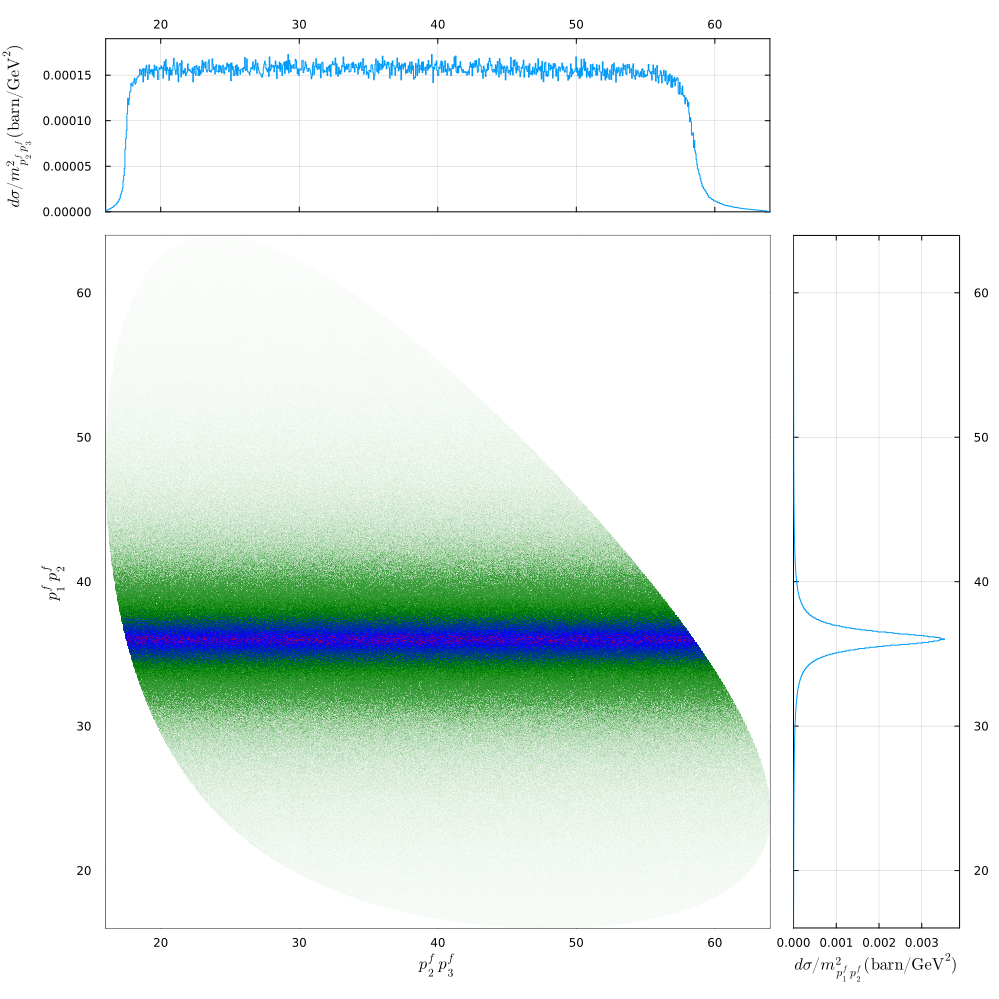

# DalitzPlot

This Julia package, designed for plotting Dalitz plots, allows users to visualize particle three-body decays with a specified amplitude. The package offers flexibility in amplitude settings, enabling users to customize the plot according to their specific requirements.

The cross section can be obtained from the amplitudes ${\cal M}$ as 

$d\sigma=F|{\cal M}|^2\frac{1}{S}d\Phi=(2\pi)^{4-3n}F|{\cal M}|^2\frac{1}{S}dR$ 

with $dR=(2\pi)^{3n-4}d\Phi=\prod_{i}\frac{d^3k_i}{2E_i}\delta^4(\sum_{i}k_i-P)$ which is the Lorentz-invaitant phase space for $n$ particles, which is generated by the Monte-Carlo method in Ref. [F.James, CERN 68-12] 

For cross section, the flux factor $F=\frac{1}{2E2E'v_{12}}=\frac{1}{4[(p_1\cdot p_2)^2-m_1^2m_2^2]^{1/2}}	\frac{|p_1\cdot p_2|}{p_1^0p_2^0}$. Here the relation in Laboratory or center of mass frame, $\vec p_1^2\vec p_2^2=(\vec p_1\cdot\vec p_2)^2$ is used. In Laboratory frame $\frac{|p_1\cdot p_2|}{p_1^0p_2^0}=1$. 
If we replace a boson or zero mass spinor paricle to a nonzero mass
spinor particle, $1/2\rightarrow m$.  The $S=\prod_i m_i!$ if there are $m_i$ identical particles. 

For decay width, the flux factor is replaced by $F=\frac{1}{2E}$.


## Installation

To install the package, use the standard Julia package manager procedure:

```julia
Pkg.add("DalitzPlot")
using DalitzPlot
```

or 

```julia
pkg> add "https://github.com/junhe1979/DalitzPlot.jl"
using DalitzPlot
```

## Provide amplitudes with factors 

The user should provide amplitudes with factors  $(2\pi)^{4-3n}F|{\cal M}|^2\frac{1}{S}$ in the function (with name `amp` here)

We can take it as 1
```julia
amp(tecm, kf, ch, para)=1.
```

Define more complicated amplitudes for a 2->3 process. The `tecm` is total energy in the center-of-mass frame. The `kf` is final momenta generated. The `ch` is the information about the process, which will be defined below. The `para` contains extra parameters.

```julia
function amp(tecm, kf, ch, para)
    # get kf as momenta in the center-of-mass ,
    #k1,k2,k3=getkf(kf)       
    #get kf as momenta in laboratory frame
    k1, k2, k3 = getkf(para.p, kf, ch)

    # Incoming particle momentum
    # Center-of-mass frame: p1 = [p 0.0 0.0 E1]
    #p1, p2 = pcm(tecm, ch.mi)
    # Laboratory frame
    p1, p2 = plab(para.p, ch.mi)

    #flux
    #flux factor for cross section in Laboratory frame
    fac = 1 / (4 * para.p * ch.mi[2] * (2 * pi)^5)

    k12 = k1 + k2
    s12 = cdot(k12, k12)
    m = 3.0
    A = 1e8 / (s12 - m^2 + im * m * 0.1)

    total = abs2(A) * fac* 0.389379e-3

    return total

```
## Provide the mass of initial and final particles. 

The mass of initial and final particles should be saved in a NameNuptle (named `ch` here) as `mi` and `mf`.

The name of the particles can be also provided for PlotD as `namei` and `namef`.

The function for amplitudes with factors should be saved as `amp` here

```julia
ch = (mi=[1.0, 1.0], mf=[1.0, 1.0, 1.0],namei=["p^i_{1}", "p^i_{2}"], namef=["p^f_{1}", "p^f_{2}", "p^f_{3}"], amp=amp) 
```
## Provide the momentum. 

Here the `p` is the momentum in Laboratory frame. It can be also input directly. 
```julia
p = 10.0
```
## Calculate:  

In function `Xsection`, the events will be generated by `GENEV` function, and the events with amplitudes will be collected in `Nbin` bins. 

The function `plab2pcm` transforms the momentum of the incoming particle from the Laboratory frame to the total energy in the center-of-mass frame, a crucial step in the subsequent calculations. The variable `nevtot` represents the total number of events produced.

```julia
res = Xsection(plab2pcm(p, ch.mi), ch, nevtot=Int64(1e7), Nbin=100, para=(p=p, l=1.0), ProgressBars=true)
```
The results of the calculations are stored in the variable `res` as a NamedTuple. Specifically, `res.cs0` corresponds to the total cross section, `res.cs1` represents the invariant mass spectrum, and `res.cs2` captures the data for the Dalitz plot.

## Plot Dalitz Plot.
```julia
plotD(res, ch, axes=[1, 3])
```

