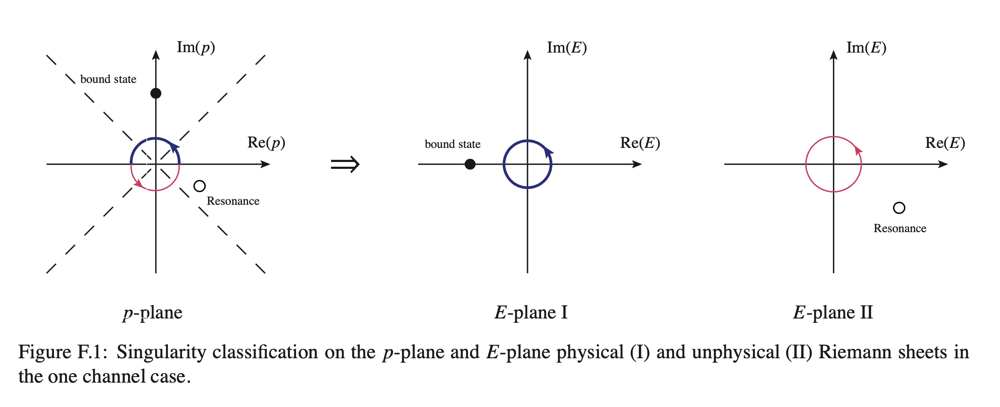

<!-- START doctoc generated TOC please keep comment here to allow auto update -->

<!-- DON'T EDIT THIS SECTION, INSTEAD RE-RUN doctoc TO UPDATE -->

**Table of Contents**  *generated with [DocToc](https://github.com/thlorenz/doctoc)*

- [Derivation of quasipotential Bethe-Salpeter equation](#derivation-of-quasipotential-bethe-salpeter-equation)
  - [Quasipotential approximation](#quasipotential-approximation)
  - [Partial-wave expansion](#partial-wave-expansion)
  - [Fixed parity](#fixed-parity)
- [Solution of quasipotential Bethe-Salpeter equation](#solution-of-quasipotential-bethe-salpeter-equation)
  - [Independent amplitudes](#independent-amplitudes)
  - [Treatment of the singularity](#treatment-of-the-singularity)
  - [Transformation to a matrix equation](#transformation-to-a-matrix-equation)
  - [For old code](#for-old-code)
  - [Pole search](#pole-search)
- [2-2 cross section](#2-2-cross-section)
  - [The cross section for the channel considered](#the-cross-section-for-the-channel-considered)
  - [Argand plot](#argand-plot)
- [Three body decay](#three-body-decay)
  - [kinematics](#kinematics)
    - [Lorentz boost](#lorentz-boost)
  - [Amplitude](#amplitude)
  - [Decay width](#decay-width)
- [qBSE package](#qbse-package)
  - [Data Structures for the Interactions](#data-structures-for-the-interactions)
    - [`structSys`](#structsys)
    - [`structInterAction`](#structinteraction)
  - [Data Structures for the Dimensions](#data-structures-for-the-dimensions)
    - [`structChannel`](#structchannel)
    - [`structIndependentHelicity`](#structindependenthelicity)
  - [Additional Data Structures](#additional-data-structures)
    - [`structMomentum`](#structmomentum)
    - [`structHelicity`](#structhelicity)
  - [Particle](#particle)
    - [`particles!(filename::String)`](#particlesfilenamestring)
  - [Functions for the qBSE](#functions-for-the-qbse)
    - [`function preprocessing(Sys, qn, channels, Ff, config, Np, Nx, Nphi)`](#function-preprocessingsys-qn-channels-ff-config-np-nx-nphi)
    - [`function FFre(k, cutoffi, cutofff; cutoff_re_type=:Lambda, CHi=nothing, CHf=nothing, key_ex=0)`](#function-ffrek-cutoffi-cutofff-cutoff_re_typelambda-chinothing-chfnothing-key_ex0)
    - [`function propFFex(k, key_ex, cutoff; cutoff_ex_type=:Lambda, FF_ex_type=3)`](#function-propffexk-key_ex-cutoff-cutoff_ex_typelambda-ff_ex_type3)
    - [`function fV(k, l, SYS, IA0, CHf, CHi, VVertex)`](#function-fvk-l-sys-ia0-chf-chi-vvertex)
  - [Functions for rescattering amplitudes and poles](#functions-for-rescattering-amplitudes-and-poles)
    - [auxiliary function](#auxiliary-function)
    - [`function resc0(Range, iER, qn, SYS, IA, CH, IH, VVertex)`](#function-resc0range-ier-qn-sys-ia-ch-ih-vvertex)
    - [`function resc(Sys, qn, Range, channels, Ff, cutoff, VVertex; Np=10, Nx=10, Nphi=5)`](#function-rescsys-qn-range-channels-ff-cutoff-vvertex-np10-nx10-nphi5)
    - [`function simpleXsection(ER, resM2, CH, qn; Ep=("cm",))`](#function-simplexsectioner-resm2-ch-qn-epcm)
    - [`function lambda(m1, m2, m3)`](#function-lambdam1-m2-m3)
  - [Decay](#decay)
    - [`function proc(pf, pin, amps)`](#function-procpf-pin-amps)
    - [`function LorentzBoost(k::SVector{5,Float64}, p::SVector{5,Float64})`](#function-lorentzboostksvector5float64-psvector5float64)
    - [`function setTGA(par, sij, k, tecm, i, j)`](#function-settgapar-sij-k-tecm-i-j)
    - [`TGA(para, cfinal, cinter, ranges)`](#tgapara-cfinal-cinter-ranges)
      - [`function Vertex14(k, P, l, Vert)`](#function-vertex14k-p-l-vert)

<!-- END doctoc generated TOC please keep comment here to allow auto update -->

- [Quasipotential approximation](#quasipotential-approximation)
  - [Partial-wave expansion](#partial-wave-expansion)
  - [Fixed parity](#fixed-parity)
  - [Transformation to a matrix equation](#transformation-to-a-matrix-equation)
  - [Code](#code)
  - [Pole search](#pole-search)
  - [Physical observable](#physical-observable)
    - [The cross section for the channel considered](#the-cross-section-for-the-channel-considered)
    - [Argand plot](#argand-plot)
- [Three body decay](#three-body-decay)
  - [kinematics](#kinematics)
    - [Lorentz boost](#lorentz-boost)
  - [Amplitude](#amplitude)
  - [Decay width](#decay-width)
    - [The case with one rescattering](#the-case-with-one-rescattering)
      - [Phase space](#phase-space)
      - [Differential decay width](#differential-decay-width)
    - [The case with more than one rescattering](#the-case-with-more-than-one-rescattering)
- [qBSE package](#qbse-package)
  - [Data Structures for the Interactions](#data-structures-for-the-interactions)
    - [`structSys`](#structsys)
    - [`structInterAction`](#structinteraction)
  - [Data Structures for the Dimensions](#data-structures-for-the-dimensions)
    - [`structChannel`](#structchannel)
    - [`structIndependentHelicity`](#structindependenthelicity)
  - [Additional Data Structures](#additional-data-structures)
    - [`structMomentum`](#structmomentum)
    - [`structHelicity`](#structhelicity)
  - [Particle](#particle)
    - [`structParticle`](#structparticle)
    - [function to read partilce data file](#function-to-read-partilce-data-file)
  - [Functions for the qBSE](#functions-for-the-qbse)
    - [`function preprocessing(Sys, qn, channels, Ff, cutoff, Np, Nx, Nphi)`](#function-preprocessingsys-qn-channels-ff-cutoff-np-nx-nphi)
    - [`function FFre(k, cutoffi, cutofff; cutoff_re_type=:Lambda, CHi=nothing, CHf=nothing, key_ex=0)`](#function-ffrek-cutoffi-cutofff-cutoff_re_typelambda-chinothing-chfnothing-key_ex0)
    - [`function propFFex(k, key_ex, cutoff; cutoff_ex_type=:Lambda, FF_ex_type=3)`](#function-propffexk-key_ex-cutoff-cutoff_ex_typelambda-ff_ex_type3)
    - [`function fV(k, l, SYS, IA0, CHf, CHi, VVertex)`](#function-fvk-l-sys-ia0-chf-chi-vvertex)
  - [Functions for rescattering amplitudes and poles](#functions-for-rescattering-amplitudes-and-poles)
    - [auxiliary function](#auxiliary-function)
    - [`function resc0(Range, iER, qn, SYS, IA, CH, IH, VVertex; eps)`](#function-resc0range-ier-qn-sys-ia-ch-ih-vvertex-eps)
    - [`function resc(Sys, qn, Range, channels, Ff, cutoff, VVertex; Np=10, Nx=10, Nphi=5,eps=+1e-4im)`](#function-rescsys-qn-range-channels-ff-cutoff-vvertex-np10-nx10-nphi5eps1e-4im)
    - [`function simpleXsection(ER, resM2, CH, qn; Ep=("cm",))`](#function-simplexsectioner-resm2-ch-qn-epcm)
    - [`function lambda(m1, m2, m3)`](#function-lambdam1-m2-m3)
  - [Decay](#decay)
    - [`function proc(pf, pin, amps)`](#function-procpf-pin-amps)
    - [`function LorentzBoostRotation(k, tecm, p1, p2)`](#function-lorentzboostrotationk-tecm-p1-p2)
    - [`function setTGA(par, sij, k, tecm, i, j)`](#function-settgapar-sij-k-tecm-i-j)
    - [`TGA(para, cfinal, cinter, ranges)`](#tgapara-cfinal-cinter-ranges)
      - [`function Vertex14(k, P, l, Vert)`](#function-vertex14k-p-l-vert)

<!-- tocstop -->

# Derivation of quasipotential Bethe-Salpeter equation

## Quasipotential approximation

The general form of the Bethe-Salpeter equation (BSE) for the scattering amplitude can be written as follows:

$$
\begin{align}
{\cal M}(k'_1k'_2,k_1k_2;P)&={\cal
V}(k'_1k'_2,k_1k_2;P)+\int\frac{d^4
k''_2}{(2\pi)^4}
{\cal
V}(k'_1k'_2,k''_1k''_2;P)G(k''_1k''_2;P){\cal
M}(k''_1k''_2,k_1k_2;P),\quad
\end{align}
$$

where ${\cal V}$ is the potential kernel and $G$ is the propagator for the two constituent particles. The total momentum of the system is denoted by $P = k_1 + k_2 = k'_1 + k'_2 = k''_1 + k''_2$, with $k_{1,2}$, $k'_{1,2}$ and $k''_{1,2}$ being the initial, final and intermediate momenta, respectively.

The Bethe-Salpeter equation can be succinctly expressed as

$$
{\cal M} = {\cal V} + {\cal V} G {\cal M},
$$

The Bethe-Salpeter (BS) equation for the amputated scattering matrix without external legs, denoted as ${\cal M}_{\mu'_1\mu'_2\mu_1\mu_2}$, is given by:

$$
\begin{align}
	{\cal M}_{\mu'_1\mu'_2\mu_1\mu_2}={\cal V}_{\mu'_1\mu'_2\mu_1\mu_2}
	+{\cal V}_{\mu'_1\mu'_2\rho'_1\rho'_2}G^{\rho'_1\rho'_2\rho_1\rho_2}{\cal
	M}_{\rho_1\rho_2\mu_1\mu_2},
\end{align}
$$

where the propagator for the two constituent particles is given by

$$
\begin{align}
G^{\rho'_1\rho'_2\rho_1\rho_2} = G_1^{\rho'_1\rho_1} \otimes G_2^{\rho'_2\rho_2}
= \frac{iP_1^{\rho'_1\rho_1}}{(k_1^2 - m_1^2)} \otimes\frac{iP_2^{\rho'_2\rho_2}}{(k_2^2 - m_2^2)}
=[ \sum_{\lambda_1} A_{1\lambda_1}^{\rho'_1} \bar{A}_{1\lambda_1}^{\rho_1} \otimes \sum_{\lambda} A_{2\lambda_2}^{\rho'_2} \bar{A}_{2\lambda_2}^{\rho_2}] \tilde{G}_0,
\end{align}
$$

where $P_i^{\rho'_i\rho_i}$ is a general tensor structure. For example, for two vector mesons, $P^{\rho'\rho} = (-g^{\rho'\rho} + k^{\rho'} k^{\rho} / m^2)=\sum_\lambda \varepsilon^{\rho'}_\lambda\varepsilon^{\rho*}_\lambda$; for two spin-$1/2$ baryons, $P = (\gamma \cdot k + m)=2m \sum_\lambda u_\lambda \bar{u}_\lambda$ (Here we adopt convetion $\bar{u}u=1$).
In general, such propagators are difficult to handle because the potential ${\cal V}$ and amplitude ${\cal M}$ cannot be factorized. However, since the dominant contribution comes from the region where both constituents are near their mass shells, a form factor or cutoff is usually introduced to restrict the propagator to the near on-shell region. Therefore, it is reasonable to approximate $P^{\rho'\rho}$ by its on-shell value, which can be expressed as a sum over polarization vectors or spinors: $P^{\rho'\rho} \approx \sum_{\lambda} A_{\lambda}^{\rho'} \bar{A}_{\lambda}^{\rho}$, where $A$ denotes the polarization vector  $\varepsilon$  or spinor $u$.   The factor $\tilde{G}_0$ is given by
$
\tilde{G}_0 = -\frac{1}{(k_1^2-m_1^2)(k_2^2-m_2^2)},
$
where, for **fermions**, an additional $2m$ factor should be included, as required by the spinor convention.

After projecting the Bethe-Salpeter (BS) equation onto the polarization states, i.e., multiplying both sides by $\bar{A}_{1\lambda'_1}\bar{A}_{2\lambda'_2}$ and $A_{1\lambda_1}A_{2\lambda_2}$, the BS equation becomes

$$
\begin{align}
	i\bar{A}_{1\lambda'_1} \bar{A}_{2\lambda'_2}{\cal M}A_{1\lambda_1} A_{2\lambda_2}=i\bar{A}_{1\lambda'_1} \bar{A}_{2\lambda'_2}{\cal V}A_{1\lambda_1} A_{2\lambda_2}
	+\sum_{\lambda''_1, \lambda''_2}(i\bar{A}_{1\lambda'_1} \bar{A}_{2\lambda'_2}{\cal V}A_{\lambda''_1} {A}_{\lambda''_2}) \tilde{G}_0/i   (i\bar{A}_{\lambda''_1} \bar{A}_{\lambda''_2}{\cal	M}A_{1\lambda_1} A_{2\lambda_2}),
\end{align}
$$

We define $\bar{A}_{1\lambda'_1}\bar{A}_{2\lambda'_2}\mathcal{M}A_{1\lambda_1}A_{2\lambda_2}$ as $\mathcal{M}_{\lambda'_1\lambda'_2\lambda_1\lambda_2}$, and similarly define the potential as $\bar{A}_{1\lambda'_1}\bar{A}_{2\lambda'_2}\mathcal{V}A_{1\lambda_1}A_{2\lambda_2} \equiv \mathcal{V}_{\lambda'_1\lambda'_2\lambda_1\lambda_2}$. In addition, we include the form factors of the two interacting particles in both the potential and the amplitude; for example, for the potential, $f(k'_1)f(k'_2)\mathcal{V}_{\lambda'_1\lambda'_2\lambda_1\lambda_2}f(k_1)f(k_2)$. This means that the obtained amplitudes include the form factor when the particles are off-shell. Hereafter, we will not explicitly show such form factors unless necessary. 

The Gross form of proposed quasipotential propagators for particles 1 and 2 with mass $m_1$ and $m_2$ written down in
the center of mass frame where $P=(W,{\boldsymbol 0})$ with particle 2 being on shell are

$$
\begin{align}
\tilde{G}_0=\frac{-1}{(k_1^2-m_1^2)(k_2^2-m_2^2)}\to g=2\pi i\frac{\delta^+(k_2^2-m_2^2)}{k_1^2-m_1^2}=2\pi
i\frac{\delta(k^0_2-E_2)}{2E_2[(W-E_2)^2-E_1^2]},
\end{align}
$$

where $k_1=(k_1^0,\boldsymbol k)=(E_1,\boldsymbol k)$, $k_2=(k_2^0,-\boldsymbol k)=(W-E_1,-\boldsymbol k)$ with $E_1=\sqrt{m_1^2+|\boldsymbol k|^2}$.

With the define of $G_0=g/(2\pi i)=\frac{1}{2E_2[(W-E_2)^2-E_1^2]}$, the four-dimensional BSE can be reduced to a three-dimensional equation in center of mass frame

$$
\begin{align}
i{\cal M}_{\lambda'_1\lambda'_2\lambda_1\lambda_2}({\boldsymbol k}',{\boldsymbol k})&=i{\cal
V}_{\lambda'_1\lambda'_2\lambda_1\lambda_2}({\boldsymbol k}',{\boldsymbol k})+\sum_{\lambda''_1, \lambda''_2}\int\frac{d
{\boldsymbol k}''}{(2\pi)^3}
i{\cal
V}_{\lambda'_1\lambda'_2\lambda''_1\lambda''_2}({\boldsymbol k}',{\boldsymbol k}'')G_0({\boldsymbol k}'')i{\cal
M}_{\lambda''_1\lambda''_2\lambda_1\lambda_2}({\boldsymbol k}'',{\boldsymbol k}),\quad
\end{align}
$$

Note: the $i{\cal M}$ and $i{\cal V}$ are usually real. In the center of mass frame. We choose ${\boldsymbol k}_2={\boldsymbol k}$ and ${\boldsymbol k}_1=-{\boldsymbol k}$.

In the one-boson-exchange model, the potential can be written as

$$
\begin{align}
i{\cal V}=\sum_{J_e=0}I_e^0\frac{-\Gamma_{upper}\Gamma_{lower}}{q^2-m_e^2}f_e(q^2) 
+\sum_{J_e=1}I_e^1\frac{-\Gamma_{upper}^\mu\Gamma_{lower}^\nu(-g^{\mu\nu}+q^\mu q^\nu/m_e^2)}{q^2-m_e^2}f_e(q^2)
\end{align}
$$
where the minus sign arises from the $i$ in $i{\cal V}$ and the $i$ in the propagator. $J_e$ and $m_e$ are the spin and mass of the exchanged meson and only $J_e\leq1$ are considered.
For a discussion on relating the potential kernel to the potential in the Schrödinger equation, see Ref. [He:2014nya].

With the Lagrangians, the interaction vertices can be written straightforwardly by applying the following rules:

- Legs:

  + Scalar meson (spin $S = 0$): $1$
  + Vector meson ($S = 1$): $\varepsilon^\mu$
  + Baryon ($S = 1/2$): $u$
  + Baryon ($S = 3/2$): $u^\mu$
- Derivatives: $\partial^\mu \to -ip^\mu$
  (Note: Pay attention to the momentum orientation when applying this rule.)
- $\gamma$ matrices and $\epsilon^{\mu\nu\rho\lambda}$ tensors remain unchanged.
- An additional factor of $i$ should be included for each vertex.

## Partial-wave expansion

To reduce the equation to one-dimensional equation, we apply the partial wave expansion,

$$
\begin{align}
{\cal V}_{\lambda'\lambda}({\boldsymbol k}',{\boldsymbol k})&\equiv\langle\theta'\phi',\lambda'|{\cal V}|\theta\phi,\lambda\rangle
=\sum_{J'M'JM}\langle\theta'\phi'|J'M',\lambda'\rangle\langle J'M'|{\cal V}|JM,\lambda\rangle\langle JM,\lambda|\theta\phi,\lambda\rangle
\nonumber\\
&=\sum_{JM }N_J^2D^{J*}_{M\lambda'}(\phi',\theta',0){\cal
	V}^{JM}_{\lambda'\lambda}({\rm k}',{\rm k})D^{J}_{M\lambda}(\phi,\theta,0)
=\sum_{J }N_J^2D^{J}_{\lambda'\lambda}(\Omega^{-1}\Omega'){\cal
	V}^{J}_{\lambda'\lambda}({\rm k}',{\rm k})
	.
\nonumber\\
{\cal V}_{\lambda'\lambda}^{JM}({\rm k}',{\rm k})&=
N^2_J\int d\Omega' d\Omega
D^{J}_{M,\lambda'}(\phi',\theta',0){\cal V}_{\lambda'\lambda}({\boldsymbol k}',{\boldsymbol k})D^{J*}_{M,\lambda}(\phi,\theta,0).
\end{align}
$$

where $N_J=\sqrt{\frac{2J+1}{4\pi}}$, $\int d\Omega D^{J*}_{\lambda_1,\lambda_2}(\phi,\theta,0)D^{J'*}_{\lambda'_1,\lambda'_2}(\phi,\theta,0)=N_J^{-2}$, and $\sum_{M }D^{J*}_{M\lambda'}(\Omega)D^{J}_{M\lambda}(\Omega')=D^{J}_{\lambda'\lambda}(\Omega^{-1}\Omega')$

To calculate ${\cal V}_{\lambda'\lambda}^{JM}({\rm k}',{\rm k})$, we adopt a special CMS frame. The momenta are chosen as $k_2=(E_2,0,0,{\rm k})$, $k_1=(W-E_2,0,0,-{\rm k})$  and $k'_2=(E'_2,{\rm k}'\sin\theta_{k,k'},0,{\rm k}'\cos\theta_{k,k'})$, $k'_1=(W-E_2, -{\rm k}'\sin\theta_{k,k'},0,-{\rm k}'\cos\theta_{k,k'})$ with ${\rm k}=|{\boldsymbol k}|$ and ${\rm k}'=|{\boldsymbol k}'|$.

$$
\begin{align}
\to{\cal V}_{\lambda'\lambda}({\boldsymbol k}',{\boldsymbol k})&=
	\sum_{JM}N^2_JD^{J*}_{M\lambda'}(0,\theta_{k',k},0){\cal
	V}^{JM}_{\lambda'\lambda}({\rm k}',{\rm k})D^{J}_{M\lambda}(0,0,0).
\nonumber\\
&=\sum_{JM}N^2_Jd^{J}_{M\lambda'}(\theta_{k',k}){\cal
	V}^{JM}_{\lambda'\lambda}({\rm k}',{\rm k})\delta_{M\lambda}
	=\sum_{J}N^2_Jd^{J}_{\lambda,\lambda'}(\theta_{k',k}){\cal
	V}^J_{\lambda'\lambda}({\rm k}',{\rm k})
\nonumber\\
{\cal V}_{\lambda'\lambda}^J({\rm k}',{\rm k})&=2\pi\int d\cos\theta_{k,k'} d^{J}_{\lambda,\lambda'}(\theta_{k',k})
{\cal V}_{\lambda'\lambda}({\boldsymbol k}',{\boldsymbol k}).
\end{align}
$$

where $\int^1_{-1}d\cos\theta' d^{J'}_{\lambda,\lambda'}(\theta')d^{J}_{\lambda,\lambda'}(\theta')=N_J^{-2}/2\pi\delta_{JJ'}$ are used.

NOTE: Which particle is chosen to parallel to $z$ axis is related to the order of $\lambda$ and $\lambda'$ in $d^{J}_{\lambda'\lambda}(\theta_{k,k'})$, so it can not be chosen arbitrarily. And the definition of helicity is also dependent of the definition of ${\boldsymbol k}_{1,2}$. Here, $\lambda=\lambda_2-\lambda_1$  and $\lambda_1=-s_1$, $\lambda_2=s_2$. For brevity, however, the subscript $\lambda$ in $\mathcal{V}$ and $\mathcal{M}$ is used as a shorthand for the pair $(\lambda_1,\lambda_2)$; this shorthand should be distinguished from the true $\lambda = \lambda_2 - \lambda_1$ appearing in the Wigner $d$-function.

The scattering amplitudes ${\cal M}$ has analogous relations.
Now we have the partial wave BS equation,

$$
\begin{align}
i{\cal M}^J_{\lambda',\lambda}({\rm k}',{\rm k})&=
N^2_J\int d\Omega' d\Omega D^{J*}_{\lambda_R,\lambda'}(\phi',\theta',0)D^{J}_{\lambda_R,\lambda}(\phi,\theta,0)\nonumber\\
&\cdot\left[i{\cal V}_{\lambda'\lambda}({\boldsymbol k}',{\boldsymbol
k})+\int\frac{d{\boldsymbol k}''}{(2\pi)^3}i{\cal V}_{\lambda'\lambda''}({\boldsymbol
k}',{\boldsymbol k}'') G_0({\boldsymbol k}'')i{\cal M}_{\lambda''\lambda}({\boldsymbol k}'',{\boldsymbol k})\right]\nonumber\\
&=i{\cal V}^J_{\lambda'\lambda}({\rm k}',{\rm k})+\int\frac{{\rm k}''^2d{\rm k}''}{(2\pi)^3}i{\cal V}^J_{\lambda'\lambda''}({\rm k}',{\rm k}'')
G_0({\boldsymbol k}'')i{\cal M}^J_{\lambda''\lambda}({\rm k}'',{\rm k})
\end{align}
$$

## Fixed parity

For a helicity state $|J,\lambda_1\lambda_2\rangle\equiv|J,\lambda\rangle$ fulfill the party property,

$$
\begin{align}
	P|J,\lambda\rangle=P|J,\lambda_1\lambda_2\rangle
	=\eta_1\eta_2(-1)^{J-s_1-s_2}|J,-\lambda_1-\lambda_2\rangle
	\equiv\tilde{\eta}|J-\lambda\rangle
\end{align}
$$

The construction of normalized states with parity $\pm$ is now straightforward:

$$
\begin{align}
	 |J,\lambda;\pm\rangle&=\frac{1}{\sqrt{2}}(|J,+\lambda\rangle\pm\tilde{\eta}
	|J,-\lambda\rangle\nonumber\\
	\Rightarrow P|J,\lambda;\pm\rangle&=
	 \frac{1}{\sqrt{2}}(\tilde{\eta}|J,-\lambda\rangle\pm|J,+\lambda\rangle)
	 =\pm\frac{1}{\sqrt{2}}(\pm\tilde{\eta}|J,-\lambda\rangle+|J,\lambda\rangle)
        =\pm|J,\lambda;\pm\rangle
\end{align}
$$

The amplitude with fixed parity is defined as

$$
{\cal M}^{J\pm}_{\lambda'\lambda}=\langle J,\lambda';\pm|{\cal M}|J,\lambda;\pm\rangle
$$

With such definition, we have

$$
\begin{align}
{\cal M}^{J\pm}_{\lambda'-\lambda}=\pm\tilde{\eta} {\cal M}^{J\pm}_{\lambda'\lambda}\equiv\eta {\cal M}^{J\pm}_{\lambda'\lambda},\ \ {\cal M}^{J\pm}_{-\lambda'\lambda}=\pm\tilde{\eta}' {\cal M}^{J\pm}_{\lambda'\lambda}\equiv\eta' {\cal M}^{J\pm}_{\lambda'\lambda}
\end{align}
$$

with $\eta=PP_1P_2(-1)^{J_1+J_2-J}$.

For parity conserving interactions $M = \hat{P}^{−1}M \hat{P}$ follows:

$$
\begin{align}
{\cal M}^{J}_{-\lambda'-\lambda}=\tilde{\eta}\tilde{\eta}'{\cal M}^{J}_{\lambda'\lambda}
\end{align}
$$

We have

$$
\begin{align}
	&{\cal M}^{J\pm}_{\lambda'\lambda}=\langle J,\lambda';\pm|{\cal M}|J,\lambda;\pm\rangle
	={\cal M}^{J}_{\lambda'\lambda}\pm \tilde{\eta} {\cal M}^J_{\lambda'-\lambda}
	={\cal M}^{J}_{\lambda'\lambda}\pm \tilde{\eta}'{\cal M}^J_{-\lambda'\lambda}
\end{align}
$$

$$
\begin{align}
i{\cal V}_{\lambda'\lambda}^{J^P}({\rm k}',{\rm k})
&=2\pi\int d\cos\theta
~[d^{J}_{\lambda\lambda'}(\theta)
i{\cal V}_{\lambda'\lambda}({\boldsymbol k}',{\boldsymbol k})
+\eta d^{J}_{-\lambda\lambda'}(\theta)
i{\cal V}_{\lambda'-\lambda}({\boldsymbol k}',{\boldsymbol k})],
\end{align}
$$

The potential ${\cal V}^{J^P}_{\lambda'\lambda}$ has analogous relations.

$$
\begin{align}
	 i{\cal M}^J_{\lambda'\lambda}&=i{\cal V}^J_{\lambda'\lambda}+\sum_{\lambda''}i{\cal V}^J_{\lambda'\lambda''}G_0i{\cal M}^J_{\lambda''\lambda},\quad	 \eta' i{\cal M}^J_{-\lambda'\lambda}=\eta' i{\cal V}^J_{-\lambda'\lambda}+\sum_{\lambda''}\eta' i{\cal V}^J_{-\lambda'\lambda''}G_0 i{\cal M}^J_{\lambda''\lambda}\nonumber\\
\Rightarrow i{\cal M}^{J^P}_{\lambda'\lambda}&=i{\cal V}^{J^P}_{\lambda'\lambda}+\sum_{\lambda''}i{\cal V}^{J^P}_{\lambda'\lambda''}G_0i{\cal M}^{J}_{\lambda''\lambda},\nonumber\\
&=i{\cal V}^{J^P}_{\lambda'\lambda}+\frac{1}{2}\sum_{\lambda''}(i{\cal V}^{J^P}_{\lambda'\lambda''}G_0i{\cal M}^{J}_{\lambda''\lambda}+i{\cal V}^{J^P}_{\lambda'-\lambda''}G_0i{\cal M}^{J}_{-\lambda''\lambda})\nonumber\\
&=i{\cal V}^{J^P}_{\lambda'\lambda}+\frac{1}{2}\sum_{\lambda''}(i{\cal V}^{J^P}_{\lambda'\lambda''}G_0i{\cal M}^{J}_{\lambda''\lambda}+i{\cal V}^J_{\lambda'\lambda''}G_0\eta''i{\cal M}^{J^P}_{-\lambda''\lambda})\nonumber\\
&=i{\cal V}^{J^P}_{\lambda'\lambda}+\frac{1}{2}\sum_{\lambda''}i{\cal V}^{J^P}_{\lambda'\lambda''}G_0i{\cal M}^{J^P}_{\lambda''\lambda},
\end{align}
$$

In fact such relation can bde generalized as

$$
\begin{align}
	 {\cal C}^J_{\lambda'\lambda}&=\sum_{\lambda''}{\cal A}^J_{\lambda'\lambda''}{\cal B}^J_{\lambda''\lambda}
\Rightarrow {\cal C}^{J^P}_{\lambda'\lambda}=
\frac{1}{2}\sum_{\lambda''}{\cal A}^{J^P}_{\lambda'\lambda''}{\cal B}^{J^P}_{\lambda''\lambda},
\end{align}
$$

# Solution of quasipotential Bethe-Salpeter equation

## Independent helictiy amplitudes

With Eq. (13), the amplitudes with different helicities are not independent. To reduce the calculation time, we only keep the independent helicity amplitudes as

$$
\begin{align}
\sum_{\lambda''}{\cal A}^{J^P}_{\lambda'\lambda''}{\cal B}^{J^P}_{\lambda''\lambda}
={\cal A}^{J^P}_{\lambda'0}{\cal B}^{J^P}_{0\lambda}+2\sum_{ \lambda''\in I_{\neq0}}{\cal A}^{J^P}_{\lambda' \lambda''}{\cal B}^{J^P}_{\lambda''\lambda}=2\sum_{k}{\cal A}^{J^P}_{\lambda' k}{\cal B}^{J^P}_{k\lambda}.
\end{align}
$$

where $k$ are the indices for the independent helicity amplitudes, and $I_{\neq0}$ means the nonzero independent helicites.  And we redefine

$$
f_{\lambda'} f_\lambda \mathcal{A}^{J^P}_{\lambda'\lambda} \equiv \mathcal{A}^{J^P}_{ij},
$$

with $f_0=\frac{1}{\sqrt{2}}$, $f_{\lambda\neq 0}=1$, and with the amplitudes for $\lambda_1=\lambda_2=0$ set to $\lambda=0$.
Here, the subscript $ij$ denotes the amplitudes that include only the independent helicity amplitudes multiplied by the factors $f_i$ and $f_j$; these are directly provided by the program.
In contrast, the subscript $\lambda$ (i.e., $\mathcal{A}_{\lambda'\lambda}$) denotes the physical amplitudes, which must be obtained from the program outputs together with the factors $f_\lambda$.

If we only keep the independent amplitudes, the equation for definite parity can be written as
$$
\begin{align}
i{{\cal M}}^{J^P}_{ij}=i{\cal V}^{J^P}_{ij}+\sum_{k}i{\cal V}^{J^P}_{ik}G_0i{\cal M}^{J^P}_{kj}.
\end{align}
$$

The Bethe-Saltpeter equation for partial-wave amplitude with fixed spin-parity $J^P$ reads ,

$$
\begin{align}
i{\cal M}^{J^P}_{ij}({\rm k}',{\rm k})
&=i{\cal V}^{J^P}_{ij}({\rm k}',{\rm
k})+\sum_{k}\int\frac{{\rm
k}''^2d{\rm k}''}{(2\pi)^3}~
i{\cal V}^{J^P}_{ik}({\rm k}',{\rm k}'')
G_0({\rm k}'')i{\cal M}^{J^P}_{kj}({\rm k}'',{\rm
k}).
\end{align}
$$

The partial wave potential is defined  with the independent helicities as

$$
\begin{align}
i{\cal V}^{J^P}_{ij}({\rm k}',{\rm k}'')
&=f_{\lambda'}f_\lambda2\pi\int d\cos\theta
~[d^{J}_{\lambda\lambda'}(\theta)
i{\cal V}_{\lambda'\lambda}({\boldsymbol k}',{\boldsymbol k})
+\eta d^{J}_{-\lambda\lambda'}(\theta)
i{\cal V}_{\lambda'-\lambda}({\boldsymbol k}',{\boldsymbol k})].
\end{align}
$$
where $i,j$ correspond to  independent helicities $\lambda',\lambda \in I$.
Note here the $f_{\lambda'}f_\lambda$ is also incorporated. Additionally, the form factors for the interacting particles are also included in the potential, modifying it as ${\cal V}\to f(k'){\cal V}f(k)$. Consequently, the resulting amplitude ${\cal M}$ also includes these form factors.

The potential ${\cal V}_{\lambda'\lambda}({\boldsymbol k}',{\boldsymbol k})$ is introduced by `fV` function in main file as

```julia
fV(k, l, SYS, IA0, CHf, CHi, VVertex) 
```

where `k` and `l` are for the momenta and helicities of final and initial particles. `SYS` is
for the system information. `IA0` is for the interaction information., `CHf` and `CHi` are for the information of final and initial channels. `VVertex` is a function that returns the explicit form of the interaction or vertices, as defined in `main.jl`.

Transition of ${\cal V}_{\lambda'\lambda}({\boldsymbol k}',{\boldsymbol k})$ to ${\cal V}^{J^P}_{ij}({\rm k}',{\rm k}'')$ performed in `qBSE.fKernel` which is an internal function.

## Treatment of the singularity

Now We have a integral equation with singularity in $G_0=\frac{1}{2 E_2[(W-E_2)^2-E_1^2]}=\frac{1}{2 E_2[(W-E_2-E_1+i\epsilon)(W-E_2+E_1)]}$  at $W=E_1+E_2$. This singularity can be isolated as,

$$
\begin{align}
i{\cal M}^{J^P}({\rm k}',{\rm k})
&=i{\cal V}^{J^P}({\rm k},{\rm k}')+\int\frac{{\rm k}''^2d {\rm k}''}{(2\pi)^3}i{\cal V}^{J^P}({\rm k},{\rm k}'') G_0({\rm k}'')i{\cal M}^{J^P}({\rm k}'', {\rm k}')
\end{align}
$$

Using $\frac{1}{x\pm i\epsilon}={\cal P}\frac{1}{x}\mp i\pi \delta(x)$, if $W>m_1+m_2$ and $\bar{q}<q_{max}$ ( $\bar{q}=\frac{1}{2W}\sqrt{[W^2-(m_1+m_2)^2][W^2-(m_1-m_2)^2]}$ is onshell momentum),

$\int^{q_{max}}_0 dq F(q)\frac{1}{W-E_1-E_2+i\epsilon}={\cal P}\int^{q_{max}}_0 dq F(q)\frac{1}{W-E_1-E_2}- i\pi \rho(\bar{q})$

$\rho(\bar{q})=F(\bar{q})\delta(W-E_1-E_2)=F(\bar{q})\frac{\delta(q-\bar{q})}{|(-\frac{1}{2})(\frac{2\bar{q}}{\bar{E}_1}+\frac{2\bar{q}}{\bar{E}_2})|}=F(\bar{q})\frac{\bar{E}_1\bar{E}_2}{\bar{q}W}\delta(q-\bar{q})$

Using $\frac{\bar{q}^2-q^2}{W-E_1-E_2}|_{q\to \bar{q}}=\frac{-2q}{-\frac{q}{E_1}-\frac{q}{E_2}}|_{q\to \bar{q}}=\frac{2\bar{E}_1\bar{E}_2}{W}$,

${\cal P}\int^{q_{max}}_0 dq F(q)\frac{1}{W-E_1-E_2}=\int^{q_{max}}_0 dq \left[F(q)\frac{\bar{q}^2-q^2}{W-E_1-E_2}-F(\bar{q})\frac{\bar{q}^2-q^2}{W-E_1-E_2}|_{q\to \bar{q}}\right]\frac{1}{\bar{q}^2-q^2}+{\cal P}\int^{q_{max}}_0 dq F(\bar{q})\frac{\bar{q}^2-q^2}{W-E_1-E_2}|_{q\to \bar{q}}\frac{1}{\bar{q}^2-q^2}=\int^{q_{max}}_0 dq \left[F(q)\frac{1}{W-E_1-E_2}-F(\bar{q})\frac{2\bar{E}_1\bar{E}_2}{W}\frac{1}{\bar{q}^2-q^2}\right]+F(\bar{q})\frac{2\bar{E}_1\bar{E}_2}{W}\frac{1}{2\bar{q}}\ln|\frac{q_{max}+\bar{q}}{q_{max}-\bar{q}}|$

Hence, we have

$\int^{q_{max}}_0 dq F(q)\frac{1}{W-E_1-E_2+i\epsilon}=\int^{q_{max}}_0 dq \left[F(q)\frac{1}{W-E_1-E_2}-F(\bar{q})\frac{2\bar{E}_1\bar{E}_2}{W}\frac{1}{\bar{q}^2-q^2}\right]+F(\bar{q})\frac{\bar{E}_1\bar{E}_2}{\bar{q}W}\ln|\frac{q_{max}+\bar{q}}{q_{max}-\bar{q}}|- i\pi F(\bar{q})\frac{\bar{E}_1\bar{E}_2}{\bar{q}W}$

$=\int^{q_{max}}_0 dq F(q)\frac{1}{W-E_1-E_2}+F(\bar{q})\frac{\bar{E}_1\bar{E}_2}{\bar{q}W}\left[-2\bar{q}\int^{q_{max}}_0dq\frac{1}{\bar{q}^2-q^2}+\ln|\frac{q_{max}+\bar{q}}{q_{max}-\bar{q}}|- i\pi \right]$

If $q_{max}\to\infty$, $\ln|\frac{q_{max}+q_0}{q_{max}-q_0}|\to 0$.

Now

$F({\rm k}'')=\frac{{\rm k}''^2}{(2\pi)^3}i{\cal V}^{J^P}({\rm k},{\rm k}'') \frac{1}{2 E_2[W-E_2+E_1]}i{\cal M}^{J^P}({\rm k}'', {\rm k}')\to F(\bar{\rm k}'')=\frac{\bar{\rm k}''^2}{(2\pi)^3}i{\cal V}^{J^P}_o({\rm k},\bar{\rm k}'') \frac{1}{4\bar{E}_2\bar{E}_1}i{\cal M}^{J^P}_o(\bar{\rm k}'', {\rm k}')$

$$
\begin{align}
&\int\frac{{\rm k}''^2d {\rm k}''}{(2\pi)^3}i{\cal V}^{J^P}({\rm k},{\rm k}'') G_0({\rm k}'')i{\cal M}^{J^P}({\rm k}'', {\rm k}')\nonumber\\
&=\int^{{\rm k}''_{max}}_0\frac{{\rm k}''^2d {\rm k}''}{(2\pi)^3}i{\cal V}^{J^P}  G_0 i{\cal M}^{J^P}
%
+\frac{\bar{\rm k}''}{32\pi^3W}i{\cal V}_o^{J^P}({\rm k},\bar{\rm k}'') i{\cal M}_o^{J^P}(\bar{\rm k}'', {\rm k}')\left[2\bar{\rm k}''\int^{{\rm k}''_{max}}_0d{\rm k}''\frac{1}{{\rm k}''^2-\bar{\rm k}''^2}+\ln(\frac{{\rm k}''_{max}+\bar{\rm k}''}{{\rm k}''_{max}-\bar{\rm k}''})- i\pi \right]
\end{align}
$$

We have

$$
\begin{align}
Im~G=-\rho/2=-\frac{\bar{{\rm k}''}}{32\pi^2 W}.
\end{align}
$$

It should be noted that in the region $W < m_1 + m_2$, the potential remains real, since no imaginary component emerges in this energy range.

It suggests the unitary is satisfied.

$$
\begin{align}
-T^\dag \rho T=2 T^\dag~ ImG~T=2T^\dag(-Im T^{-1})T=2T^\dag\frac{1}{2i}(T^{\dag-1}- T^{-1})T=i(T-T^\dag)
\end{align}
$$

where $T=i{\cal M}$.

## Transformation to a matrix equation

With the Gauss discretization, the one-dimensional equation can be transformed as a matrix equation as

$$
\begin{align}
i{\cal M}^{J^P}_{ik}
&=&i{\cal V}^{J^P}_{ik}+\sum_{j=0}^N i{\cal V}^{J^P}_{ij}G_ji{\cal M}^{J^P}_{jk}\Rightarrow {M}^{J^P}={V}^{J^P}+{V}^{J^P}G{M}^{J^P}
\end{align}
$$

$$
\begin{align}
	G_j=\left\{\begin{array}{cl}\frac{\bar{q}}{32\pi^3 W}\left[2\bar{q}\sum_j
\frac{w(q_j)}
{q_j^2-\bar{q}^2}+\ln|\frac{{\rm k}''_{max}+\bar{\rm k}''}{{\rm k}''_{max}-\bar{\rm k}''}|-i\pi\right] & {\rm for}\ j=0,\ {\rm if}\ Re(W)>m_1+m_2,\nonumber\\
\frac{w(q_j)}{(2\pi)^3}\frac{q_j^2}
	{2E(q_j)[(W-E(q_j))^2-\omega^2(q_j)]}& {\rm for}\ j\neq0
	\end{array}\right.
\end{align}
$$

If $q_{max}\to\infty$

$$
\begin{align}
	G_j=\left\{\begin{array}{cl}-\frac{i\bar{q}}{32\pi^2 W}+\sum_j
\left[\frac{w(q_j)}{(2\pi)^3}\frac{\bar{q}^2}
{2W{(q_j^2-\bar{q}^2)}}\right] & {\rm for}\ j=0,\ {\rm if}\ Re(W)>m_1+m_2,\nonumber\\
\frac{w(q_j)}{(2\pi)^3}\frac{q_j^2}
	{2E(q_j)[(W-E(q_j))^2-\omega^2(q_j)]}& {\rm for}\ j\neq0
	\end{array}\right.
\end{align}
$$

where $\bar{q}=\frac{1}{2W}\sqrt{[W^2-(m_1+m_2)^2][W^2-(m_1-m_2)^2]}$. The indices $i, j, k$ is for discrete momentum values, independent helicities, and coupled channels.

The propagator is calculated in `qBSE.fProp` which is an internal function.

The default dimension is $[G] = 1$. Recalling that a factor of $2m$ should be included if a constituent particle is a fermion, we have $[G] = \text{GeV}^{n_f} \to [V] = [M] = \text{GeV}^{-n_f}$, with $n_f$ being the number of fermions. Therefore, under our convention where $\bar{u}u = 1$, the dimension of the potential must satisfy the above requirements. This criterion can be employed to verify the consistency of the Lagrangian and the derived potential.

Hence, for the channels above its thresholds, the matrix have an extra dimension.
We take two channel as example to explain the coupled-channel equation. The region of $W$ is divided as
$W<m_{1}$, $m_{1}<W<m_{2}$ and $W>m_{2}$.

$$
\begin{align}
%
V&=\left(\begin{array}{cc}
V^{NN}_{11}&V^{NN}_{12}\\
V^{NN}_{21}&V^{NN}_{22}
\end{array}\right),\quad
G=\left(\begin{array}{cc}
G^{N}_{1}&0\\
0&G^{N}_{2}
\end{array}\right),\quad
W<m_{1},\\
%
V&=\left(\begin{array}{cc}
V^{N+1N+1}_{11}&V^{N+1N}_{12}\\
V^{NN+1}_{21}&V^{NN}_{22}
\end{array}\right),\quad
G=\left(\begin{array}{cc}
G^{N+1}_{1}&0\\
0&G^{N}_{2}
\end{array}\right),\quad
 m_{1}<W<m_{2}
\\
V&=\left(\begin{array}{cc}
V^{N+1N+1}_{11}&V^{N+1N+1}_{12}\\
V^{N+1N+1}_{21}&V^{N+1N+1}_{22}
\end{array}\right),\quad
G=\left(\begin{array}{cc}
G^{N+1}_{1}&0\\
0&G^{N+1}_{2}
\end{array}\right),\quad W>m_{2}
\end{align}
$$

The informations about the dimensions are calculated in `qBSE.WORKSPACE`. The matrix $V$ and $G$ are calculated in `qBSE.srAB`.
Note that such function is internal function and not used by the user.

## For old code

**Attention**: The following details are specific to the old version of the code, which includes Fortran code and Julia code versions prior to v0.2.4. In the new version, the treatment described below is obsolete.

In old code, we choose $\hat{V}^{J^P}={V}^{J^P}/4\pi$, $\hat{G}=4\pi{G}$, and $\hat{M}^{J^P}={M}^{J^P}/4\pi$. The form factors are also included in to the ampltudes and the potential kernel. Hence, the qBSE becomes

$$
\begin{align}
\hat{M}^{J^P}=\hat{V}^{J^P}+\hat{V}^{J^P}G\hat{M}^{J^P}.
\end{align}
$$

Such convention is consistent with that in the chiral unitary approach.

$$
\begin{align}
\hat{V}^{J^P}&={V}^{J^P}/4\pi=i{\cal V}^{J^P}_{\lambda'\lambda''}({\rm p}',{\rm p}'')/4\pi=f_{\lambda'}f_\lambda{\cal V}_{\lambda'\lambda}^{J^P}({\rm p}',{\rm p})/4\pi \nonumber\\
&=\frac{1}{2}f_{\lambda'}f_\lambda \int d\cos\theta
~[d^{J}_{\lambda\lambda'}(\theta)
i{\cal V}_{\lambda'\lambda}({\boldsymbol p}',{\boldsymbol p})
+\eta d^{J}_{-\lambda\lambda'}(\theta)
i{\cal V}_{\lambda'-\lambda}({\boldsymbol p}',{\boldsymbol p})],
\end{align}
$$

$$
\begin{align}
	\hat{G}_j=\left\{\begin{array}{cl}-\frac{i\bar{q}}{8\pi W}+\sum_j
\left[\frac{w(q_j)}{2\pi^2}\frac{\bar{q}^2}
{2W{(q_j^2-\bar{q}^2)}}\right] & {\rm for}\ j=0,\ {\rm if}\ Re(W)>m_1+m_2,\nonumber\\
\frac{w(q_j)}{2\pi^2}\frac{q_j^2}
	{2E(q_j)[(W-E(q_j))^2-\omega^2(q_j)]}& {\rm for}\ j\neq0
	\end{array}\right.
\end{align}
$$

## Pole search

To find a bound state or resonance, the singularities should be searched at the pole of the $M(z)=0$ in the complex plane after analytic continuation total energy $W$ into the complex plane as $z$.

Since $E=\sqrt{m_1^2+p^2}+\sqrt{m_2^2+p^2}$, the $p$-plane correspond to two Reimann sheets for $E$. The bound state is located in the first Reimann sheet while the resonances located in the second Reimann sheet.



From the above figure, the resonances should be found with $Im(q)<0$. The potential $V$ is dependent on the $E$.

After extend the energy in the center of mass frame $W$ into complex energy plane as $z$, the pole can be found by variation of $z$ to satisfy

$$
\begin{align}
|1-V(z)G(z)|=0
\end{align}
$$

with $z=E_R+i\Gamma_R/2$.

The $|1-V(z)G(z)|$ in complex enery plane is calculated in `qBSE.res` and the pole can be found with function `qBSE.showPoleInfo`.

As shown above, the propagator acquires an imaginary part in the region $W > m_1 + m_2$, specifically $-i\rho/2$. According to the Schwarz reflection principle, if a function $f(z)$ is analytic in a region of the complex plane that includes a portion of the real axis where $f$ is real, then it satisfies $[f(z^*)]^* = f(z)$. Since the propagator $G$ satisfies these conditions, we have, for ${\rm Re}(z) > m_1 + m_2$,

$$
G(z - i\epsilon) = G^*(z + i\epsilon) = G(z + i\epsilon) + i\rho.
$$

The value of the propagator at the lower edge of the branch cut on the first Riemann sheet, $G^I(z - i\epsilon)$, coincides with the upper edge of the second Riemann sheet, $G^{II}(z + i\epsilon)$. Therefore,

$$
G^{II}(z + i\epsilon) = G^I(z - i\epsilon) = G^I(z + i\epsilon) + i\rho.
$$

Before analytically continuing into the complex plane, we adopt the convention that on the first Riemann sheet, the propagator is real for $W < m_1 + m_2$, and has an imaginary part $-i\rho/2$ for $W > m_1 + m_2$. The second Riemann sheet is defined as the region where the propagator has an imaginary part of $i\rho/2$, i.e., shifted by $i\rho$ relative to the first sheet.

When searching for the poles, we use the first Riemann sheet for $W < m_1 + m_2$, and the second Riemann sheet for $W > m_1 + m_2$. In the code, the `lRm` in `qn` is chosen as `0` in this case. If only first or  second Riemann sheet is considered, `lRm` is set to `1` or `2`.

In the code, the `lRm` can be set to a `Int64` number `0`, `1`, or `2` for all channels, or `(n1,n2,n2,...)` for each channel, where `n1`, `n2`, etc. are the Riemann sheet numbers for each channel.

**Attention**: Physical observables are computed on the first Riemann sheet—more precisely, along the real axis (`lRm=1`). Therefore, for $W < m_1 + m_2$, the treatment is consistent with that used in pole searches. However, for $W > m_1 + m_2$, the pole search is carried out on the second Riemann sheet, where the propagator has an imaginary part of $i\rho/2$, in contrast to $-i\rho/2$ on the first sheet. This leads to a relative phase difference between the two Riemann sheets along the real axis.

# 2-2 cross section

With the obtained amplitude $M^{J^P}$, we can also calculate the physical observable. Note that all physical observable are at real axis, we choose the onshell momentum as

$$
\begin{align}
M_{ij}(z)=\{[(1-VG)^{-1}]V\}_{ij}
\end{align}
$$

with $i$ and $k$ chosen as the onshell momentum, that is, $0$ dimension for $G$, and extra dimension for $V$.

The $|M|^2$ for each channel is calculated in `qBSE.res`.

### The cross section for the channel considered

The cross section, denoted by $d\sigma$, can be expressed in terms of
amplitudes, ${\mathcal M}$, as follows:

$$
d\sigma=F\frac{1}{S}\frac{1}{\tilde{j}_1\tilde{j}_2}\sum|{\mathcal M}|^2d\Phi=(2\pi)^{4-3n}F\frac{1}{S}\frac{1}{\tilde{j}_1\tilde{j}_2}\sum|{\mathcal M}|^2dR
$$

The flux factor $F$ for the cross section is given by:

$$
F=\frac{1}{2E_12E_2v_{12}}=\frac{1}{4[(p_1\cdot p_2)^2-m_1^2m_2^2]^{1/2}}\frac{|p_1\cdot p_2|}{p_1^0p_2^0}
$$

In the laboratory or center of mass frame, the relation
$\vec{p}_1^2 \vec{p}_2^2 = (\vec{p}_1 \cdot \vec{p}_2)^2$ is utilized.
In the laboratory frame, the term $\frac{|p_1\cdot p_2|}{p_1^0 p_2^0}$
simplifies to 1. In center of mass frame, $v_{12}=\frac{{\rm k}(E_1+E_2)}{E_1E_2}=\frac{{\rm k}\sqrt{s}}{E_1E_2}$. Additionally, if a boson or zero-mass spinor particle
is replaced with a non-zero mass spinor particle, the factor $1/2$ is
replaced with the mass of the particle, $m$,  due to convention $\bar{u}u=1$ adopted. The total symmetry factor
$S$ is given by $\prod_i n_i!$ if there are $n_i$ identical particles.

For the open channel, the cross section can be obtained as

$$
\begin{align}
	\frac{d\sigma}{d\Omega}=\frac{1}{\tilde{j}_1\tilde{j}_2}\frac{1}{64\pi^2
	s}\frac{{\rm k}'}{{\rm k}}\sum_{\lambda'\lambda}|i{\cal M}_{\lambda'\lambda}({\boldsymbol k}',{\boldsymbol k})|^2.
\end{align}
$$

where $j_1$ and $j_2$ is the spin of the intitial particles, and we define $\tilde{j}=2j+1$.

The total cross section can be written as

$$
\begin{align}
	\sigma
&=\frac{1}{\tilde{j}_1\tilde{j}_2}\frac{1}{64\pi^2
	s}\frac{{\rm k}'}{{\rm k}}\sum_{J,\lambda'\lambda}N_J^2|i{\cal M}^J_{\lambda'\lambda}({\rm k}',{\rm k})|^2
=\frac{1}{\tilde{j}_1\tilde{j}_2}\frac{1}{64\pi^2
	s}\frac{{\rm k}'}{{\rm k}}\sum_{J,\lambda'\lambda}N_J^2|\frac{1}{2}i{\cal M}^{J^P}_{\lambda'\lambda}({\rm k}',{\rm k})|^2
\nonumber\\&=\frac{1}{\tilde{j}_1\tilde{j}_2}\frac{1}{64\pi^2
	s}\frac{{\rm k}'}{{\rm k}}\sum_{J^P,ij}N_J^2\left|{{ M}}^{J^P}_{ij}\right|^2.
\end{align}
$$

Here, ${\rm k}'$ and ${\rm k}$ are onshell momenta, so we only choose $ij$ for the onshell momenta. Since we adopt ${\cal V}\to f(k'){\cal V}f(k)$, the amplitudes ${M}^{J^P}\to f(k'){M}^{J^P}f(k)$. The form factors vanish due to onshelness for initial and final states of a scattering.

$M^{J^\pm}_{\lambda'\lambda}=M^{J}_{\lambda'\lambda}\pm \tilde{\eta}'M^{J}_{-\lambda'\lambda}=M^{J}_{\lambda'\lambda}\pm \tilde{\eta}M^{J}_{\lambda'-\lambda}$

$M^J_{\lambda'\lambda}=\frac{1}{2}(M^{J^+}_{\lambda'\lambda}+M^{J^-}_{\lambda'\lambda})$,
$M^J_{\lambda'-\lambda}=\frac{1}{2\tilde{\eta}}(M^{J^+}_{\lambda'\lambda}-M^{J^-}_{\lambda'\lambda})$

$M^J_{\lambda' 0}=\frac{1}{2}(\delta_{\tilde{\eta}'1}M^{J^+}_{\lambda' 0}+\delta_{\tilde{\eta}'-1}M^{J^-}_{\lambda' 0})$

$|M^J_{\lambda' 0}|^2=|\frac{1}{2}(\delta_{\tilde{\eta}'1}M^{J^+}_{\lambda' 0}+\delta_{\tilde{\eta}'-1}M^{J^-}_{\lambda' 0})|^2=\delta_{\tilde{\eta}'1}|\frac{1}{2}M^{J^+}_{\lambda' 0}|^2+\delta_{\tilde{\eta}'-1}|\frac{1}{2}M^{J^-}_{\lambda' 0}|^2=\sum_P|\frac{1}{2}M^{J^P}_{\lambda' 0}|^2$

$$
\begin{align}
	\sigma&\propto \sum_{J,\lambda'\lambda}
	|M^{J}_{\lambda'\lambda}|^2=\sum_{J,\lambda'}|M^{J}_{\lambda'0}|^2+\sum_{J,\lambda',\lambda\in I_{\neq0}}
	\left[|M^{J}_{\lambda'\lambda}|^2+|M^{J}_{\lambda'-\lambda}|^2\right]\nonumber\\
&=\sum_{J^P,\lambda'}|\frac{1}{2} M^{J^P}_{\lambda'0}|^2+\sum_{J,\lambda'\lambda\in I_{\neq0}}
	 \left[\frac{1}{4}|M^{J^+}_{\lambda'\lambda}+M^{J^-}_{\lambda'\lambda}|^2+\frac{1}{4}|M^{J^+}_{\lambda'\lambda}-M^{J^-}_{\lambda'\lambda}|^2\right]\nonumber\\
&=\sum_{J^P,\lambda'}|\frac{1}{2} M^{J^P}_{\lambda'0}|^2+\frac{1}{2}\sum_{J^P,\lambda'\lambda\in I_{\neq0}} |M^{J^P}_{\lambda'\lambda}|^2=\sum_{J^P,\lambda'\lambda} |\frac{1}{2}M^{J^P}_{\lambda'\lambda}|^2\nonumber\\
&=\sum_{J^P}|\frac{1}{2}M^{J^P}_{00}|^2+\sum_{J^P,\lambda'\in I_{\neq0}}2|\frac{1}{2} M^{J^P}_{\lambda'0}|^2+\sum_{J^P,\lambda'\lambda\in I_{\neq0}}
	\frac{1}{2}|M^{J^P}_{\lambda'\lambda}|^2\nonumber\\
&=\sum_{J^P}|\frac{1}{2} M^{J^P}_{00}|^2
+\sum_{J^P,\lambda'\in I_{\neq0}}|\frac{1}{\sqrt{2}} M^{J^P}_{\lambda'0}|^2
+\sum_{J^P,\lambda\in I_{\neq0}}|\frac{1}{\sqrt{2}}M^{J^P}_{0\lambda}|^2
+\sum_{J^P,\lambda'\in I_{\neq0}\lambda\in I_{\neq0}}|M^{J^P}_{\lambda'\lambda}|^2\nonumber\\
&=\sum_{J^P,\lambda'\in I\lambda\in I}|f_{\lambda'}f_{\lambda}M^{J^P}_{\lambda'\lambda}|^2\to\sum_{J^P,ij}|{M}^{J^P}_{ij}|^2
\end{align}
$$

The cross section for certain channel is calculated with `qBSE.simpleXsection`

### Argand plot

The amplitudes can be written as

$$
\begin{align}
	i{\cal M}({\boldsymbol k}', {\boldsymbol k})=-8\pi\sqrt{s}f({\boldsymbol k}',{\boldsymbol
	k})=-\frac{8\pi\sqrt{s}}{|{\boldsymbol k}|}\sum
	 _{JM}N^2_J D^{J*}_{\lambda_R,\lambda}(\phi',\theta',0)
	a^J_{\lambda\lambda'}(|{\boldsymbol	k}'|,|{\boldsymbol k}|)D^{J}_{M,\lambda'}(\phi,\theta,0).
\end{align}
$$

where $a^J=-\frac{|{\boldsymbol k}|}{8\pi\sqrt{s}}{\cal M}^J(|{\boldsymbol k}|)$, which can be displayed as a trajectory in an Argand plot.

# Three body decay

## kinematics

### Lorentz boost

Here, we consider an process $Y\to X m_3...m_n\to [m_1m_2]m_3...m_n$.
To study a $1\to n$ decay with the qBSE, we need consider the center of mass frame (CMS) of $Y$ (which is also the laboratory frame in this issue) and the $m_1m_2$ where the qBSE is applied. The momenta of initial and final particles in the CMS of $Y$, remarked as $lab$,  are

$$
P^{lab}=(W,0,0,0),\  \ p^{lab}_i=(E^{lab}_i,{\boldsymbol p}^{lab}_i).
$$

The  Lorentz boost from $(m,{\boldsymbol 0})$ to $(E,{\boldsymbol k})$,

$$
\begin{align}
\Lambda^{\mu}_\nu=\frac{1}{m}\left(\begin{array}{cccc}
E({\boldsymbol k})&k_x&k_y&k_z\nonumber\\
k_x&m+\frac{k_x k_x}{E+m}&\frac{k_x k_y}{E+m}&\frac{k_x k_z}{E+m}\nonumber\\
k_y&\frac{k_y k_x}{E+m}&m+\frac{k_y k_y}{E+m}&\frac{k_y k_z}{E+m}\nonumber\\
k_z&\frac{k_z k_x}{E+m}&\frac{k_z k_y}{E+m}&m+\frac{k_z k_z}{E+m}\nonumber\\
\end{array}\right).
\end{align}
$$

With  the Lorentz boost  the momenta for particle 12 in the laboratory frame $(E^{lab}_{12},{\boldsymbol p}^{lab}_{12})$ can be written with the momenta in the CMS of particles 12 $(M_{12},{\boldsymbol 0})$ as $p^{lab}=\Lambda(E^{lab}_{12},{\boldsymbol p}^{lab}_{12}) p^{cm}$,

$$
\begin{align}
{\boldsymbol p}^{lab}&={\boldsymbol p}^{cm}+\frac{{\boldsymbol p}^{lab}_{12}}{M_{12}}\left[\frac{{\boldsymbol p}^{lab}_{12}\cdot {\boldsymbol p}^{cm}}{E^{lab}_{12}+M_{12}}+p^{0cm}\right],\nonumber\\
p^{0lab}&=\frac{1}{M_{12}}\left[E^{lab}_{12}p^{0cm}+{\boldsymbol p}^{lab}_{12}\cdot{\boldsymbol p}^{cm}\right],
\end{align}
$$

where $M_{12}=\sqrt{(p^{lab}_1+p^{lab}_2)^2}=\sqrt{(p^{cm}_1+p^{cm}_2)^2}$, $E^{lab}_{12}=E^{lab}_{1}+E^{lab}_{2}$ (onshell) and $E^{lab}_{12}=W-\sum_{n\neq1,2}E^{lab}_{n}$ (offshell).

The momenta in CMS of $12$ can also be written with the momentum in laboratory frame as $p=\Lambda(E^{lab}_{12},-{\boldsymbol p}^{lab}_{12}) p^{lab}$

$$
\begin{align}
{\boldsymbol p}^{cm}&={\boldsymbol p}^{lab}-\frac{{\boldsymbol p}^{lab}_{12}}{M_{23}}\left[-\frac{{\boldsymbol p}^{lab}_{12}\cdot {\boldsymbol p}^{lab}}{E^{lab}_{12}+M_{12}}+p^{0lab}\right], \nonumber\\
p^{0cm}&=\frac{1}{M_{12}}\left[E^{lab}_{12}p^{0lab}-{\boldsymbol p}^{lab}_{12}\cdot{\boldsymbol p}^{lab}\right].
\end{align}
$$

The Lorentz boost is performed by `Xs.LorentzBoost`.

## Amplitude

Because the $|{\cal M}|^2$ is invariant in different reference frame, the amplitude for the direct decay can be written with the momenta in cm frame of partilces 1 and 2 obtained with Lorentz boost, as (here, we ignore the notation $cm$)

$$
\begin{align}
i{\cal M}^{d}_{\lambda'_1,\lambda'_2,\lambda'_{3};\lambda}(p'_1,p'_2,p'_{3})&=i{\cal A}_{\lambda'_1,\lambda'_2;\lambda'_3;\lambda}(p'_1,p'_2,p'_3)=i{\cal A}_{\lambda'_1,\lambda'_2;\lambda'_3;\lambda}(\Omega'_2,\Omega'_3,M_{12}), \nonumber\\
%
&=\sum_{JM}N_JD^{J*}_{ M\lambda'_{21}}( \Omega'_2)i{\cal A}^{JM}_{\lambda'_1,\lambda'_2;\lambda'_3;\lambda}(\Omega'_3,M_{12}),\ \ \ {\rm for\ onshell}\nonumber\\
%
i{\cal M}^{d}_{\lambda''_1\lambda''_2;\lambda'_3;\lambda}(p''_1,p''_2,p'_3)&=i{\cal A}_{\lambda''_1\lambda''_2;\lambda'_3;\lambda}(\Omega''_2,{\rm p}''_2,\Omega'_3,M_{12}) \nonumber\\
%
&=\sum_{JM}N_JD^{J*}_{M\lambda''_{21}}( \Omega''_2)i{\cal A}^{JM}_{\lambda''_1\lambda''_2;\lambda'_3;\lambda}({\rm p}''_2,\Omega_3,M_{12}),\ \ \ {\rm for\ offshell}\nonumber\\
%
i{\cal A}^{JM}_{\lambda''_1\lambda''_2;\lambda'_3;\lambda}(\Omega'_3,M_{12},{\rm p}''_2)&=
N_J\int d\Omega''_2D^{J}_{M,\lambda''_{21}}( \Omega''_2) i{\cal A}_{\lambda''_1,\lambda''_2;\lambda'_3;\lambda}(\Omega''_2,{\rm p}''_2,\Omega'_3,M_{12})\nonumber\\
%
i{\cal M}^{Z}_{\lambda'_1,\lambda'_2;\lambda'_3;\lambda}(p'_1,p'_2,p'_3)&=i\int \frac{d^4p''_2}{(2\pi)^4} {\cal T}_{\lambda'_1,\lambda'_2}(p'_1,p'_2;p''_1,p''_2)  G(p''_2){\cal A}_{\lambda'_3;\lambda}(p''_1,p''_2,p_3)\nonumber\\
%
&=\sum_{\lambda''_1\lambda''_2}\int \frac{d^3p''_2}{(2\pi)^3} i{\cal T}_{\lambda'_1,\lambda'_2;\lambda''_1,\lambda''_2}(p'_1,p'_2;p''_1,p''_2)  G_0(p''_2)i{\cal A}_{\lambda''_1,\lambda''_2;\lambda'_3;\lambda}(p''_1,p''_2,p'_3)\nonumber\\
%
&=\sum_{\lambda''_1\lambda''_2}\int \frac{d^3p''_2}{(2\pi)^3} i{\cal T}_{\lambda'_1,\lambda'_2;\lambda''_1,\lambda''_2}(\Omega'_2,\Omega''_2,{\rm p}''_2,M_{12})  G_0({\rm p}''_2)i{\cal A}_{\lambda''_1,\lambda''_2;\lambda'_3;\lambda}(\Omega''_2,{\rm p}''_2,\Omega'_3,M_{12})\nonumber\\
%
&=\sum_{\lambda''_1\lambda''_2}\int \frac{{\rm p}''^{2}_2d{\rm p}''_2d\Omega''_2}{(2\pi)^3} \sum_{J'M'}N_{J'}^2D^{J'*}_{M'\lambda'_{21}}(\Omega'_2)i{\cal T}^{J'M'}_{\lambda'_1,\lambda'_2;\lambda''_1,\lambda''_2}({\rm p}''_2,M_{12})D^{J'}_{M'\lambda''_{21}}(\Omega''_2)  \nonumber\\
&\ \cdot\ G_0({\rm p}''_2)\sum_{JM}N_{J}D^{J*}_{M\lambda''_{21}}( \Omega''_2)i{\cal A}^{JM}_{\lambda''_1,\lambda''_2;\lambda'_3;\lambda}({\rm p}''_2,\Omega'_3,M_{12})\nonumber\\
%
&=\sum_{\lambda''_1\lambda''_2}\int \frac{{\rm p}''^{2}_2d{\rm p}''d\Omega''_2}{(2\pi)^3} \sum_{JM}N_JD^{J*}_{M\lambda'_{21}}(\Omega'_2)i{\cal T}^J_{\lambda'_1,\lambda'_2;\lambda''_1,\lambda''_2}({\rm p}''_2,M_{12})   G_0({\rm p}''_2)i{\cal A}^{JM}_{\lambda''_1,\lambda''_2;\lambda'_3;\lambda}({\rm p}''_2,\Omega'_3,M_{12})\nonumber\\
%
&=\sum_{JM}N_JD^{J*}_{M\lambda'_{21}}(\Omega'_2)\sum_{\lambda''_1\lambda''_2}\int \frac{{\rm p}''^{2}_2d{\rm p}''_2}{(2\pi)^3} i{\cal T}^J_{\lambda'_1,\lambda'_2;\lambda''_1,\lambda''_2}({\rm p}''_2,M_{12}) G_0({\rm p}''_2) i{\cal A}^{JM}_{\lambda''_1,\lambda''_2;\lambda'_3;\lambda}({\rm p}''_2,\Omega'_3,M_{12})\nonumber\\
&\equiv i{\cal M}^{Z}_{\lambda'_1,\lambda'_2;\lambda'_3;\lambda}(\Omega'_2,\Omega'_3,M_{12}).
\end{align}
$$

Here, the partilce 3 can be extended to $3...n$.

Note: when consider the rescattering of different particles, the different cm frames should be adopted.

## Decay width

The phase space is given by

$$
\begin{align}
d\Phi=(2\pi)^4\delta^4(P-\sum_{i=1}^n p_i)\prod_{i=1}^n \frac{d^3p_i}{2E_i(2\pi)^3}
\end{align}
$$

We conisder Monte-Carlo method to generate the
event.

$$
\begin{align}
d\Gamma=\frac{1}{2E}\sum|{\cal M}|^2 d\Phi=\frac{1}{2E}\sum|{\cal M}|^2 (2\pi)^{4-3n} dR
\end{align}
$$

The distribution can be calculated with `qBSE.Xsection`.

Here we consider a process with $ij$ rescattering ($k$ denote other particles).

$$
\begin{align}
i{\cal M}^{d}_{\lambda'_i,\lambda'_j;\lambda'_k;\lambda}(p'_i,p'_j,p'_k)&=i{\cal A}_{\lambda'_i,\lambda'_j;\lambda'_k;\lambda}(p'_i,p'_j,p'_k),\nonumber\\
%
%
i{\cal M}^{Z}_{\lambda'_i,\lambda'_j;\lambda'_k;\lambda}(p'_i,p'_j,p'_k)
&=\sum_{JM}N_{J}D^{J*}_{M\lambda'_{ji}}(\Omega_j)\sum_{\lambda''_i\lambda''_j}\int \frac{{\rm p}''^{2}_jd{\rm p}''_j}{(2\pi)^3} i{\cal T}^J_{\lambda'_i,\lambda'_j;\lambda''_i,\lambda''_j}({\rm p}''_j,M_{ij})  \ G_0({\rm p}''_j) i{\cal A}^{JM}_{\lambda''_i,\lambda''_j;\lambda'_k;\lambda}({\rm p}''_j,\Omega'_k,M_{ij}).
\end{align}
$$

In this case, we do not make a partial-wave decomposition for the full process but only for the $ij$ system. Hence, for $A$, we do not apply partial-wave decomposition to the initial state, and it should be treated strictly according to its definition.

With the standard definitions
$|J,\lambda;\pm\rangle=\frac{1}{\sqrt{2}}\bigl(|J,+\lambda\rangle\pm\tilde{\eta}|J,-\lambda\rangle\bigr),$
the partial-wave amplitudes with fixed parity should be

$$
A^{J^\pm}_{\lambda}=\frac{1}{\sqrt{2}}\bigl(A^{J}_{\lambda}\pm\tilde{\eta}'A^{J}_{-\lambda}\bigr).
$$

Here, $\lambda$ refers to the helicites of the $ij$ system on which we perform the partial-wave decomposition, while other helicities are omitted. The above definition differs from those with partial-wave decomposition on both the initial and final states and application of parity conservation, such as  $T$, by an additional factor $\frac{1}{\sqrt{2}}$. To be consistent with the definition of $T$, we change it to

$$
A^{J^\pm}_{\lambda}=A^{J}_{\lambda}\pm\tilde{\eta}'A^{J}_{-\lambda}.
$$

With such a definition and Eqs. (18) and (19), we have

$$
\begin{align}
	M^{J}_{\lambda'}&=\sum_{\lambda''}
	T^{J}_{\lambda'\lambda''}A^{J}_{\lambda''}=\frac{1}{2}\sum_P M^{J^P}_{\lambda'}
   =\frac{1}{4}\sum_PT^{J^P}_{\lambda'\lambda''}A^{J^P}_{\lambda''}=\frac{1}{2}\sum_P T^{J^P i}_{\lambda' i}A^{J^P}_i
   =\frac{1}{2}\sum_P T^{J^P }_{\lambda' }A^{J^P}.
\end{align}
$$

$$
\begin{align}
&{\cal A}^{J^PM}_{\lambda''_i,\lambda''_j;\lambda'_k;\lambda}(...)=N_J
\int d\Omega''_j \left[D^{J}_{M,\lambda''_{ji}}(\phi''_j, \theta''_j,0) {\cal A}_{\lambda''_i,\lambda''_j;\lambda'_k;\lambda}(...,\Omega''_j,...)+\eta''D^{J}_{M,-\lambda''_{ji}}(\phi''_j, \theta''_j,0) {\cal A}_{-\lambda''_i,-\lambda''_j;\lambda'_k;\lambda}(...,\Omega''_j,...)\right].
\end{align}
$$

$$
\begin{align}
i{\cal M}^{Z}_{\lambda_i',\lambda'_j;\lambda_k';\lambda}(p_k,p_i,p_j)
&=\frac{1}{2}\sum_{J^PM}N_JD^{J*}_{M\lambda'_{ji}}(\Omega'_j)\int \frac{{\rm p}''^{2}_jd{\rm p}''_j}{(2\pi)^3} \sum_{i''j''}i{\cal T}^{J^P}_{\lambda'_i,\lambda'_j;i''j''}({\rm p}'_j,M_{ij})  \ G_0({\rm p}''_j) i{\cal A}^{J^PM}_{i''j'';\lambda'_k;\lambda}({\rm p}''_j,\Omega'_k,M_{ij}).
\end{align}
$$

The amplitude  are calculated in `qBSE.TGA`.

Note that in most cases, other mechanisms such as background must be considered, so the amplitudes should be calculated directly using $i{\cal M}^{Z}_{\lambda_i',\lambda'_j;\lambda_k';\lambda}(p_k,p_i,p_j)$, where the indices between $T$ and $A$ involve only the independent helicities. However, for the final state, all helicities must be summed; therefore, we need to use the relation between the physical helicities and the independent helicities.

If $A$ is a $2\to2$ process, the partial-wave decomposition can be applied to both the initial and final states.

$$
\begin{align}
i{\cal M}^{Z}_{\lambda'_1,\lambda'_2;\lambda_1,\lambda_2}(p'_1,p'_2,p_1,p_2)
%
&=\sum_{\lambda''_1\lambda''_2}\int \frac{{\rm p}''^{2}_2d{\rm p}''_2d\Omega''_2}{(2\pi)^3} \sum_{J'M'}N_{J'}^2D^{J'*}_{M'\lambda'_{21}}(\Omega'_2)i{\cal T}^{J'M'}_{\lambda'_1,\lambda'_2;\lambda''_1,\lambda''_2}({\rm p}''_2,\cdots)D^{J'}_{M'\lambda''_{21}}(\Omega''_2)  \nonumber\\
&\ \cdot\ G_0({\rm p}''_2)\sum_{JM}N^2_{J}D^{J*}_{M\lambda''_{21}}( \Omega''_2)i{\cal A}^{JM}_{\lambda''_1,\lambda''_2;\lambda_1,\lambda_2}({\rm p}_2,\cdots)\delta_{M\lambda_{21}}\nonumber\\
%
&=\sum_{\lambda''_1\lambda''_2}\int \frac{{\rm p}''^{2}_2d{\rm p}''d\Omega''_2}{(2\pi)^3} \sum_{J}N^2_{J}D^{{J}*}_{\lambda_{12}\lambda'_{21}}(\Omega'_2)i{\cal T}^J_{\lambda'_1,\lambda'_2;\lambda''_1,\lambda''_2}({\rm p}'_2,\cdots)   G_0({\rm p}''_2)i{\cal A}^{J}_{\lambda''_1,\lambda''_2;\lambda_1,\lambda_2}({\rm p}_2,\cdots)\nonumber\\
%
&=\sum_{J}N^2_JD^{J*}_{\lambda_{12}\lambda'_{21}}(\Omega'_2)\sum_{\lambda''_1\lambda''_2}\int \frac{{\rm p}''^{2}_2d{\rm p}''_2}{(2\pi)^3} i{\cal T}^J_{\lambda'_1,\lambda'_2;\lambda''_1,\lambda''_2}({\rm p}'_2,\cdots) G_0({\rm p}''_2) i{\cal A}^{J}_{\lambda''_1,\lambda''_2;\lambda_1,\lambda_2}({\rm p}''_2,\cdots)\nonumber\\
&\equiv \sum_JN_J^2D^{J*}_{\lambda_{12}\lambda'_{21}}(\Omega'_2) i{\cal M}^{J}_{\lambda'_i,\lambda'_j;\lambda_i,\lambda_j}.
\end{align}
$$

$$
\begin{align}
{\cal A}^{J^P}_{\lambda''_i,\lambda''_j;\lambda_i,\lambda_j}
&=2\pi
\int d\cos\theta'' \left[d^{J}_{\lambda,\lambda''}(\theta'') {\cal A}_{\lambda''_i,\lambda''_j;\lambda_i,\lambda_j}+\eta''d^{J}_{\lambda,-\lambda''}(\theta'') {\cal A}_{-\lambda''_i,-\lambda''_j;\lambda_i,\lambda_j}\right]
\nonumber\\
&=2\pi\int d\cos\theta''
~\left[d^{J}_{\lambda\lambda''}(\theta'')
{\cal A}_{\lambda''_i,\lambda''_j;\lambda_i,\lambda_j}
+\eta d^{J}_{-\lambda,\lambda''}(\theta'')
{\cal A}_{\lambda''_i,\lambda''_j;-\lambda_i,-\lambda_j}\right],.
\end{align}
$$

$$
\begin{align}
\int d\Omega'\sum_{\lambda'_i,\lambda'_i;\lambda_i,\lambda_j}|i{\cal M}^{Z}_{\lambda'_i,\lambda'_j;\lambda_i,\lambda_j}|^2
=\sum_{\lambda'_i,\lambda'_i;\lambda_i,\lambda_j,J}N^2_J|i{\cal M}^{J}_{\lambda'_i,\lambda'_j;\lambda_i,\lambda_j}|^2
=\sum_{ij,J}N^2_J|i{\cal M}^{J^P}_{ij}|^2.
\end{align}
$$

$$
i{\cal M}^{J^P}_{ij}=\int \frac{{\rm p}'^{2}_jd{\rm p}'_j}{(2\pi)^3} \sum_{k}i{\cal T}^{J^P}_{ik} \ G_0 i{\cal A}^{J^P}_{kj}
$$

# qBSE package

The qBSE package is used to solve the Bethe-Salpeter equation with some auxiliary functions.

## Data Structures for the Interactions

In the qBSE package, interaction and system information are encapsulated in dedicated data structures to facilitate efficient computation and clear organization.

### `structSys`

The `struct structSys` (often referenced as `SYS` in the code) stores information about the system and the generally used discretization and angular integration data. Its fields include:

- `Sys::String`: A label identifying the system.
- `kv::Vector{Float64}`, `wv::Vector{Float64}`: Discretized momentum points and weights for the momentum discretization (used in numerical integration).
- `xv::Vector{Float64}`, `wxv::Vector{Float64}`: Discretized values and weights of $\cos\theta$.
- `d::Vector{Matrix{Float64}}`: Precomputed Wigner $d$-matrices of $\theta$.
- `pv::Vector{Float64}`, `wpv::Vector{Float64}`: Discretized azimuthal angles and weights of $\phi$ discretization.
- `sp::Vector{Float64}`, `cp::Vector{Float64}`: Sine and cosine values of the discretized $\phi$ angles.
- `expphi::Matrix{Complex{Float64}}`: Precomputed $e^{i\phi}$ factors for partial-wave projections.
- `ChUA::Symbol`: Selects the chiral unitary approach variant; `:off` disables it, `:qBSE` uses the qBSE propagator, and `:oset1405` uses the standard oset1405 prescription.
- `potential::Symbol`: Specifies whether the potential is `:PW`  or `:nopW` .
- `cutoff_type::Symbol`: Defines the cutoff scheme: `:infty` for an infinite cutoff with exponential form factor, or `:cut` for a finite momentum cutoff.
- `cutoff_re_type::Symbol`: Type of cutoff applied to the constituent (rearranged) particles. Options include `:Lambda` (fixed $\Lambda$), `:alpha` ($\Lambda = m + 0.22\alpha$, with $m$ the exchanged meson mass), and `:alpha_light` (uses the mass of the light meson).
- `cutoff_ex_type::Symbol`: Type of cutoff for the exchanged meson (e.g., `:Lambda` for a fixed value).
- `cutoff_ex::Float64`: Numerical value of the cutoff for the exchanged meson.
- `FF_ex_type::Int64`: Integer flag indicating the form-factor type for the exchanged meson (e.g., `3` for a dipole form).
- `channel::Dict{String,Int64}`: A dictionary storing the mapping between particle pairs and their corresponding channel number.

### `structInterAction`

The `struct structInterAction` structure (typically used as `IA` in the code) stores the properties of each interaction or exchange process. Its fields are:

- `Nex::Int64`: Total number of exchange particles or processes.
- `key_ex::Vector{String}`: Labels of the exchanged particles or interactions.
- `J_ex::Vector{Int64}`, `Jh_ex::Vector{Int64}`, `P_ex::Vector{Int64}`, `m_ex::Vector{Float64}`: Spin, parity, and mass of  exchanged particles.
- `dc::Vector{Int64}`: Indicates whether the exchange is direct or crossed.
- `Ff::Vector{Float64}`: Flavor factors associated with each exchange.

These definitions ensure that all relevant quantum numbers and parameters for each interaction are explicitly tracked, supporting flexible and accurate construction of the interaction kernel in qBSE calculations.

## Data Structures for the Dimensions

In the qBSE approach, matrix dimensions for a coupled-channel system are organized hierarchically: the outermost level corresponds to different channels, the next to independent helicities, and the innermost to discretized momentum points. The data structures are designed to clearly separate and manage these levels.

### `structChannel`

The `struct structChannel` structure encapsulates the properties of a physical channel in the qBSE package, often used as `CH` in the code. Its fields include:

- `p::Tuple{String,String}`,`p_name0::Tuple{String,String}`,`Tuple{Int,Int}`, `m::Tuple{Float64,Float64}`, `Tuple{Int64,Int64}`, `Jh::Tuple{Int64,Int64}`, `P::Tuple{Int64,Int64}`: Vectors specifying the key of partilce $p$ and those without charge `p_name0`, label for antiparticle, mass $m$, spin $J$=`J/Jh`, and parity (`P`) for each particle in the channel. Here, `Jh = 1` for integer spin and `Jh = 2` for half-integer spin.
- `cutoff::Float64` specifying the cutoff parameter for the channel.
- `IHb::Int64`, `IHe::Int64`, `IHn::Int64` indicating the starting and ending indices of independent helicities, and the total number of independent helicity states for the channel.

These definitions ensure that each channel's quantum numbers and relevant parameters are explicitly tracked, supporting efficient matrix construction and manipulation in qBSE calculations.

### `structIndependentHelicity`

The `mutable struct structIndependentHelicity` defines the independent helicity states in the qBSE package, commonly referred to as `IH` in the code. Its fields are:

- `iCH::Int64`: Index of the channel to which this independent helicity belongs.
- `hel::Tuple{Int64,Int64}`, `helh::Tuple{Int64,Int64}`: Tuples containing the helicity values and corresponding fermion/boson indicators for the independent helicity states, respectively.
- `Dimb::Int64`, `Dime::Int64`: The starting and ending indices, defining the dimension range for this helicity state.
- `k::ComplexF64`, `w::Float64`: The discretized momentum value and its associated integration weight, used in numerical quadrature.

These fields facilitate the indexing and dimensionality management of helicities, particularly in handling both on-shell and off-shell contributions within the qBSE framework.

---

`Dim::Matrix{Int64, 3, N}` and `Dimt::Array{Int64, 3, N, NE}`

The `Dim` matrix stores three pieces of information for each dimension in the total matrix:

- Element 1: Index of the independent helicity to which this dimension belongs.
- Element 2: Sequential order of this dimension within its corresponding helicity.
- Element 3: Indicator for an extra on-shell dimension (`+1` if $W > \sum m$, otherwise `0`).

Here, `N` denotes the total number of dimensions, and `NE` represents the number of energy points. The `Dimt` array extends this structure across multiple energy points.

These auxiliary data structures ensure proper association between each discretized momentum point and its corresponding helicity and integration weight, thereby enabling accurate matrix construction and numerical computations in the qBSE framework.

## Additional Data Structures

### `structMomentum`

The `struct structMomentum` structure stores the four-momenta and related kinematic quantities for a $2 \to 2$ scattering process. Its fields are:

- `i1::SVector{5,ComplexF64}`, `f1::SVector{5,ComplexF64}`: Initial and final momentum of particle 1.
- `i2::SVector{5,ComplexF64}`, `f2::SVector{5,ComplexF64}`: Initial and final momentum of particle 2.
- `q::SVector{5,ComplexF64}`: Momentum of the exchanged particle.
- `q2::Complex{Float64}`: Invariant mass squared ($q^2$) of the exchange.
- `qt::Complex{Float64}`: Additional kinematic variable (e.g., $t$-channel momentum transfer).

### `structHelicity`

The `mutable struct structHelicity` structure stores the helicity information for the particles in a $2 \to 2$ interaction. Its fields are:

- `i1::Int64`, `i1h::Int64`: Helicity and denominator for initial particle 1.
- `f1::Int64`, `f1h::Int64`: Helicity and denominator for final particle 1.
- `i2::Int64`, `i2h::Int64`: Helicity and denominator for initial particle 2.
- `f2::Int64`, `f2h::Int64`: Helicity and denominator for final particle 2.

## Particle

### `particles!(filename::String)`

Reads particle information from a formatted data file, dynamically generates a concrete type, and injects the result into the module-level `const qBSE.p`.

**Arguments**

- `filename::String` — Path to the particle data file.

**Behavior**

1. Reads the first line of the file as the **header**. Each header field becomes a field name of the generated type.
2. Infers the type of each column from the first data row:
   - `tryparse(Int, v)` succeeds for the whole column → `Int`
   - otherwise `tryparse(Float64, v)` succeeds → `Float64`
   - otherwise → `String`
3. Uses `Core.eval` to generate a concrete `struct` type `T` in the current module. Field names come from the header; field types come from step 2.
4. Parses each remaining data row, constructs a `T` instance, and stores it in a `Dict{String, T}` keyed by the first column (the charged-particle name).
5. Binds that dictionary as the module-level `const p` via `Core.eval`. If `p` already exists, an error is raised telling the user to restart the Julia session.

**Returns**

- `Dict{String, T}` — The newly constructed particle dictionary. Side effect: the module-level `qBSE.p` is bound to the same dictionary.

**Usage**

```julia
@everywhere qBSE.particles!("particles.txt")
```

Afterwards, access it from inside the package or from the main program:

```julia
qBSE.p["11"].m      # ::Float64
qBSE.p["11"].J      # ::Int
qBSE.p["11"].nameL  # ::String
```

**Notes**

1. **Call only once.** `p` is `const`; calling `particles!` again raises an error. Restart the session to switch files.
2. **Under `@everywhere`, each worker generates its own type and `p` independently.**
3. **The first data row must exist and follow the strict format.** Whether a column is `Float64` or `Int` depends on the distinction between `1.0` and `1`, so the data file must respect this convention.
4. **Do not call `particles!` at package top level or in a `const` initializer.** Otherwise `Core.eval` runs during precompilation and breaks it.
5. **`Base.invokelatest`** is used for `Dict{String,T}()` and `T(vals...)`. The type is generated at runtime.
6. **Accessing `p` inside the package**: you can write `p[key].field` directly, because `p` has already been injected into the module by `Core.eval` and is present when later code is compiled. If a function is compiled before injection but executed after, use `getfield(@__MODULE__, :p)` to resolve the binding at runtime.

## Functions for the qBSE

### `function preprocessing(Sys, qn, channels, Ff, config, Np, Nx, Nphi)`

This function is designed to be called within `res` to prepare the system and channel data structures for qBSE calculations, including the necessary discretization and quantum number information.

**Arguments:**

- `Sys::String`: Label identifying the system, stored in `SYS.Sys`.
- `qn`: Quantum numbers for the process, and labels for Riemann sheets.
- `channels`: List of channels to be included in the calculation, stored in `IA[]`.
- `Ff`: Flavor factors, stored in `IA[]`.
- `Np`, `Nx`, `Nphi`: Number of momentum discretization points, $\cos\theta$ discretization points , azimuthal angle discretization points.
- `config`: A `NamedTuple` (or `Dict`) providing runtime configuration flags. The user may supply only the required fields; omitted fields are set to their defaults as listed below:

  - `ChUA = :off` – Selects the chiral unitary approach (cutoff regularization only; dimensional regularization planned):

    - `:off` – standard qBSE (no ChUA).
    - `:qBSE` – ChUA using the qBSE propagator.
    - `:oset1405` – standard ChUA used in the calculation of $\Lambda(1405)$.
    - `:oset980` – standard ChUA used in the calculation of $f_0(980)$.
  - `cutoff_type = :infty` – Defines the ultraviolet regularization scheme:

    - `:infty` – infinite momentum cutoff with an exponential form factor (form factor provides natural damping). **Note:** `potential` must be `:nopW` in this case.
    - `:cut` – finite hard momentum cutoff (integration upper limit =$q_{max}$). **Note:** `cutoff_re_type` should be set to `:Lambda` when using this scheme.
  - `potential = :nopW` – Specifies how the potential is treated:

    - `:PW` – potential after partial-wave decompostion.
    - `:nopW` – bare potential without partial-wave decompostion.
  - `cutoff_re_type = :Lambda` – Type of cutoff applied to constituent (rearranged) particles:

    - `:Lambda` – fixed constant Λ.
    - `:alpha` – Λ = m_ex + 0.22·α, where m_ex is the mass of the exchanged meson and α is a tunable parameter.
    - `:alpha_light` – uses the mass of the lightest meson (e.g., pion) as a reference.
  - `cutoff_ex_type = :Lambda`  `cutoff_ex = 0.0`  `FF_ex_type = 3` see `function propFFex()`.

**Important constraints:**

- When `cutoff_type = :infty`, `potential` **must** be `:nopW`.
- When `cutoff_type = :cut`, `cutoff_re_type` **should** be `:Lambda` (fixed cutoff).
- The `ChUA = :qBSE`,`:oset1405` or `:qBSE` options are currently **implemented only for `cutoff_type = :cut`**; support for `:infty` is **not yet implemented** and will be added in a future release. Using these options with `:infty` may lead to incorrect results or runtime errors.

Example for arguments:

```julia
    if Sys == "KNcp"
        qn = (I=1, Ih=1, J=1, Jh=2, P=-1, C=-1, lRm=1)
        Range = (ERmin=1.2, ERmax=2.0, NER=200, EIt=0.200, NEI=20, Ep=("cm",))
        cutoff = (cutoff_re_type=:alpha_light,)
        channels = (
            ("K_b0:N_p", 1.63),
            ("pi_0:Sigma_p", 1.63),
            ("pi_p:Sigma_0", 1.63),
            ("pi_p:Lambda", 1.63),
            ("eta:Sigma_p", 1.63)
        )
        Ff = Dict{String,Any}(
            "K_b0:N_p-->K_b0:N_p" => ([["V", 1], 1.0],),
            "K_b0:N_p-->pi_0:Sigma_p" => ([["V", 1], -sqrt(0.5)],),
            "K_b0:N_p-->pi_p:Sigma_0" => ([["V", 1], sqrt(0.5)],),
            "K_b0:N_p-->pi_p:Lambda" => ([["V", 1], -sqrt(1.5)],),
            "K_b0:N_p-->eta:Sigma_p" => ([["V", 1], sqrt(1.5)],),
            "pi_0:Sigma_p-->pi_p:Sigma_0" => ([["V", 1], -2.0],)
        )
    end
```

**Returns:**

- `SYS::structSys`: The processed system object containing discretization and system information.
- `IA::Matrix{structInterAction}`: The processed interaction objects, organized as a matrix.
- `CH::Vector{structChannel}`: The processed channel objects, each describing a physical channel.
- `IH::Vector{structIndependentHelicity}`: The processed independent helicity objects, ready for use in qBSE calculations.

### `function FFre(k, cutoffi, cutofff; cutoff_re_type=:Lambda, CHi=nothing, CHf=nothing, key_ex=0)`

In the `fV` function, form factors for constituent partilces can be included via the auxiliary function `FFre` for the regulization, which is used to regulate the interaction kernel.

**Arguments:**

- `k::structMomentum`: The kinematic information for the process.
- `cutoffi::Float64`, `cutofff::Float64`: Cutoff parameters for the initial and final particles, typically set as `cutoffi = CHi.cutoff`, `cutofff = CHf.cutoff`.
- `cutoff_re_type`: The type of cutoff used for the exponential regularization of the constituent particles. Use `:Lambda` for a fixed $\Lambda$, `:alpha` for $\Lambda = m + 0.22 \alpha$, where $m$ is the mass of the exchanged meson, and `:alpha_light` for using the mass of the light meson.
- `CHi,CHf`,`ex::Int64`: Used for the type `alpha_light` and `alpha`, respectively.
- `key_ex::Int64`: Index of the exchanged particle, usually set as `key_ex = IA0.key_ex[le]`, where `le` runs over the exchanged mesons in `1:IA0.Nex`.

**Description:**

These options allow flexible control over the inclusion and type of form factors in the potential kernel, supporting different regularization schemes as needed for the physical system under study.

### `function propFFex(k, key_ex, cutoff; cutoff_ex_type=:Lambda, FF_ex_type=3)`

In the `fV` function, form factors for the exchanged mesons can be included via the auxiliary function `propFFex`.

**Arguments:**

- `k::structMomentum`: The kinematic information for the process.
- `ex::Int64`: Index of the exchanged particle, usually set as `ex = IA0.key_ex[le]`, where `le` runs over the exchanged mesons in `1:IA0.Nex`.
- `cutoff::Float64`: The cutoff parameter for the exchanged meson, often chosen as the same as the regulations.
- `cutoff_ex_type`: The type of cutoff used for the exchanged mesons. Use `:Lambda` for a fixed $\Lambda$, `:alpha` for $\Lambda = m + 0.22 \alpha$, where $m$ is the mass of the exchanged meson.
- `FF_ex_type::Int64`: Type of form factor for the exchanged meson:
  - `0`: No form factor.
  - `1`: $\frac{L^2 - m^2}{L^2 - q^2}$
  - `2`: $\frac{L^4}{(m^2 - q^2)^2 + L^4}$
  - `3`: $\exp\left(-\frac{(m^2 - q^2)^2}{L^4}\right)$
  - `4`: $\frac{L^4 + (q_t - m^2)^2 / 4}{(q^2 - (q_t + m^2) / 2)^2 + L^4}$
  - `5`: $\frac{L^2}{L^2 - q^2}$
  - `6`: $\exp\left(-\frac{(m^2 - q^2)^2}{2L^4}\right)$

**Description:**

These options allow flexible control over the inclusion and type of form factors in the potential kernel, supporting different regularization schemes as needed for the physical system under study.

### `function fV(k, l, SYS, IA0, CHf, CHi, VVertex)`

This function defines the potential kernel for qBSE calculations by extracting vertices or the direct potential from VVertex, which is then passed to the kernel function. It is responsible for computing the interaction potential between particles in a scattering process.

**Arguments:**

- `k::structMomentum`,`l::structHelicity`: The momenta and helicities of initial and final particles.
- `SYS::structSys`: The same as above.
- `IA0::structInterAction`: The interaction object containing information about the interactions and their properties, one of element of `IA` above.
- `CHf::structChannel`,`CHi::structChannel`: The final and initial channel object containing information about the final state particles, one of element of `CH` above.
- `VVertex`: The vertices of the interactions or direct potential for qBSE, which should defiend in main file.

**Returns:**

A value representing the potential kernel, suitable for use in the qBSE package's calculations.

**Note:**
This is an internal function intended for use within the qBSE package. Users should not call this function directly.

## Functions for rescattering amplitudes and poles

### auxiliary function

`qBSE.showSYSInfo(Range, qn, IA, CH, IH)`

This function is used to display the system information, including the range of energies, quantum numbers, interaction information, and channel information.

`qBSE.showPoleInfo(qn, Ec, reslog, "data/output.txt")`

This function is used to display the pole information, including the energy, width, and other relevant parameters. The results are saved in a file named "output.txt" in the "data" directory.

### `function resc0(Range, iER, qn, SYS, IA, CH, IH, VVertex)`

This function is designed to be called within `res` to  calculates the rescatering process by qBSE for a given range of energies.

**Arguments:**

- `Range`: The range of energies to be considered. For example `Range = (ERmin=1.2, ERmax=2.0, NER=200, EIt=0.200, NEI=20, Ep="cm")`
- `iER`: The index of the energy range, energy can be obtained as `ER = Range.ERmax - iER * (Range.ERmax - Range.ERmin) / (Range.NER - 1)`.
- `qn`: The quantum numbers for the process.
- `SYS`, `IA`, `CH`, `IH`:  Obtained by `preprocessing`.
- `VVertex`: Interaction vertices or direct potentials for qBSE framework.
  Flow: `VVertex` → `res` → `VGI()` → `kernel()` → `fV()` in computation pipeline.
- `eps`: Optional regularization parameter (default: 1e-4im) to add a small imaginary part to propagator denominators to avoid singularities.

**Returns:**

- `Ect::Vector{ComplexF64}`: The complex energy values for the system.
- `reslogt::Vector{Float64}`: The values of $\log|1 - VG|$.
- `resM2::Matrix{Float64}`: The matrix $|M|^2$ for the channels.
- `IH::Vector{structIndependentHelicity}`: The independent helicity objects, recalculated from the input `IH`.
- `Dim::Vector{structDimension}`: The dimension objects, recalculated from the input `Dim`.
- `TG::Matrix{ComplexF64}`: The $TG$ matrix used for decays.

### `function resc(Sys, qn, Range, channels, Ff, cutoff, VVertex; Np=10, Nx=10, Nphi=5)`

This function, which employs parallel computation to model the rescattering process via the qBSE (quantum Bethe-Salpeter equation), is designed to be called from the main program. The core calculation is implemented in the function `res0`.

**Arguments:**

- `Sys::String`: Label identifying the system, stored in `SYS.Sys`.
- `qn`: Quantum numbers for the process, and labels for Riemann sheets.
- `Range`: The range of energies to be considered. For example `Range = (ERmin=1.2, ERmax=2.0, NER=200, EIt=0.200, NEI=20, Ep="cm")`
- `channels`: List of channels to be included in the calculation, stored in `IA[]`.
- `Ff`: Flavor factors, stored in `IA[]`.
- `cutoff`: A `NamedTuple` for the last four keys of `structSys`. The user may provide only the required fields; the omitted ones will be set to default as `cutoff = (cutoff_re_type = :Lambda, cutoff_ex = 0.0, cutoff_ex_type = :Lambda, FF_ex_type = 3)`.
- `Np`, `Nx`, `Nphi`: Number of momentum discretization points, $\cos\theta$ discretization points , azimuthal angle discretization points.

**Returns:**

- `Ect::Vector{ComplexF64}`: The complex energy values for the system.
- `reslogt::Vector{Float64}`: The values of $\log|1 - VG|$.
- `resM2::Matrix{Float64}`: The matrix $|M|^2$ for the channels.
- `IH::Vector{structIndependentHelicity}`: The independent helicity objects, recalculated from the input `IH`.
- `Dim::Vector{structDimension}`: The dimension objects, recalculated from the input `Dim`.
- `TG::Matrix{ComplexF64}`: The $TG$ matrix used for decays.

### `function simpleXsection(ER, resM2, CH, qn; Ep=("cm",))`

This function computes the total cross section for a $2 \to 2$ scattering process using the squared amplitude matrix and channel information.

**Arguments:**

- `ER::Vector{Float64}`: Array of energy values (typically from `Ect`).
- `resM2::Matrix{Float64}`: Matrix of squared amplitudes $|M|^2$ for the process, as obtained from the qBSE calculation.
- `CH`: Vector of channel structures, as described above.
- `qn`: Quantum numbers for the process.
- `Ep`: Energy frame to use (`("cm",)` for center-of-mass, `("L",p1,p2)` for laboratory; default: `"cm"`).

**Returns:**
A `Vector{Matrix{Float64}}` value representing the total cross section at each energy point.

**Description:**
The function calculates the cross section by summing or integrating over the relevant momentum discretization points and applying the appropriate kinematic and symmetry factors, including spin averaging and flux normalization. It uses the channel and quantum number information to determine the initial and final state properties.

### `function lambda(m1, m2, m3)`

This function calculates the Kallen function $\lambda(m_1, m_2, m_3)$, which is used in the phase space integration.

## Decay

### `function proc(pf, pin, amps)`

This function constructs a channel tuple for use in decay width or cross section calculations, such as with `Xs.Xsection`.

**Arguments:**

- `pf`: List of final state particle names (e.g., `["pi_m", "pi_p", "pi_p", "Lambda"]`).
- `pin`: List of initial state particle names (can be empty if not needed).
- `amps`: Amplitude information or function.

**Returns:**

A tuple of the form `(pf=pf, namef=namef, mf=mf, pin=pin, namei=namei, mi=mi, amps=amps, ranges=ranges)`, where:

- `pf`, `pin`: Final and initial state particle names.
- `namef`, `namei`: Channel names for final and initial states.
- `mf`, `mi`: Masses of final and initial state particles.
- `amps`: Amplitude information.
- `ranges`: Specifies spin value ranges for final state particles. Example: `(0:0, -1:1, -1:2:1)` represents spins for $\pi$, $\rho$, and $N$ in a $\pi\rho N$ system.

**Example:**

To compute the decay width for $\Lambda_c \to \pi^- \pi^- \pi^+ \Lambda$:

```julia
ch = qBSE.ch(["pi_m", "pi_p", "pi_p", "Lambda"], [], amps)
```

The resulting `ch` can be passed directly to `Xs.Xsection`. See the `Xs.Xsection` documentation for further usage details.

### `function LorentzBoost(k::SVector{5,Float64}, p::SVector{5,Float64})`

The function `LorentzBoost` takes two arguments: `k`, which is a 5-component momentum vector, and `p`, which is a 4-component momentum vector. The function performs a Lorentz boost on the momentum vector `k` using the momentum vector `p`.

`function LorentzBoost(momenta::Vector{SVector{5,Float64}}, p::SVector{5,Float64})`

Here the momenta is a vector of 5-component momentum vectors. The function applies the Lorentz boost to each momentum vector in the array `momenta` using the momentum vector `p`.

### `function setTGA(par, sij, k, tecm, i, j)`

set the frame and other things for calculating TGA, which should be usde before `TGA` function.

**Arguments:**

- `par`: The parameters for the TGA calculation.
- `k`: The momentum of the particle in the center-of-mass (CM) frame.
- `tecm`: The total energy in the center-of-mass frame.
- `i`: The index of the first particle.
- `j`: The index of the second particle.

**Returns:**

`para=(E=sqrt(sij), par=par, IH=IH, Dim=Dim, k=kn, P=Pn,resc=(i,j))`

### `TGA(para, cfinal, cinter, ranges)`

This function calculates the transition amplitude for a given final state `cfinal` and interaction `cinter`.

**Arguments:**

- `para`: The calculation parameters, as returned by `setTGA`.
- `cfinal::String`: The final state configuration (e.g., String with `":"` for the outgoing particles).
- `cinter::Tuple{String, Float64, Function, NamedTuple}}`: The indices of intermediate channels (`ch=::String`) with weights (`weight=::Float64`), the corresponding vertex functions (`Vertex=::Function`),  and associated data, including the vertex structure, precomputed spinors or polarization vectors ( `cached=::NamedTuple` e.g., `cached=(ULc=GA1 * FR.U(para14.P, lLc),)`). The content in `cached` will be used in functions `Vertex`, such as `Vertex14(k, P, l, cached) = FR.U(k[4], l[4], bar=true) * cached.ULc`, defined in `function amps` in main file.

#### `function Vertex14(k, P, l, Vert)`

This function computes the initial decay vertex for a process involving two rescattering particles.

**Arguments:**

- `k`: Momenta of the two rescattering particles and all other final-state particles.
- `P`: Four-momentum of the parent (initial) particle.
- `l`: Helicity indices of the two rescattering particles and all other final-state particles.
- `Vert`: Vertex structure or function, defined in  `function TGA`

**Returns:**

A value representing the decay vertex amplitude, suitable for use in the qBSE package's transition amplitude calculations.
